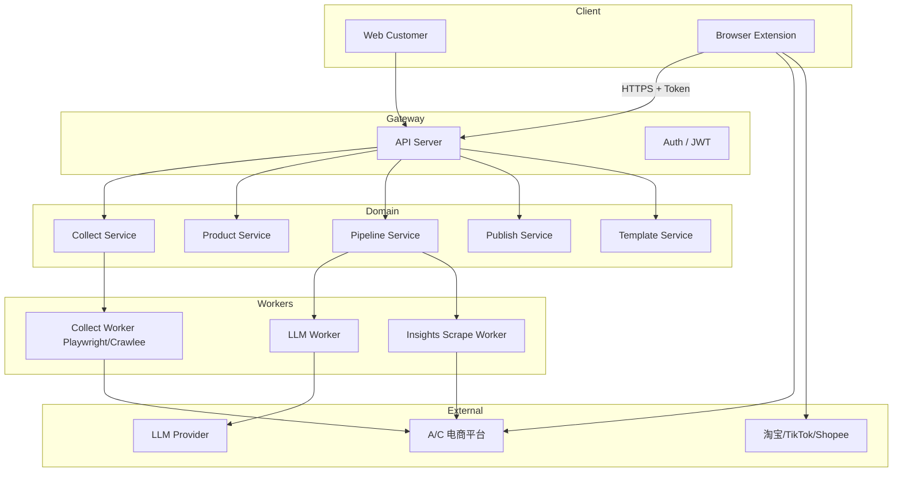

# 系统架构

## 逻辑架构



## Web 前端分层（对齐 reference-pack）

```text
Route → View → Panel
```

| 层级 | 电商助手示例 |
|------|----------------|
| `views/inbox/InboxView` | 布局：筛选栏 + 列表 Panel + 详情抽屉 |
| `panels/inbox/InboxListPanel` | 列表查询、批量删除 |
| `panels/workbench/PipelinePanel` | 执行规则/LLM、展示 diff |
| `stores/sessionStore` | 当前选中商品、面板展开 |
| `stores/authStore` | Token、用户信息 |
| React Query | `products`, `collect-jobs`, `pipelines` |

## 插件架构（Manifest V3）

```text
extension/
├── manifest.json
├── background/     # Service Worker：Token、队列、与 B 站通信
├── content/        # 按 host 分脚本：1688、shopee-seller...
├── popup/          # 快捷：采集当前页、登录状态
└── shared/         # 选择器配置、字段映射 schema
```

**消息流**：

1. Content 解析 DOM → `NormalizedProduct`
2. Background 附加 `sourceUrl`, `capturedAt` → `POST /api/v1/collect-jobs`
3. 发布：Background 拉取 `publish-tasks` → Content 填表 → 回报状态

## 处理管线数据模型

```typescript
// 概念模型（实现见 API_OUTLINE.md）
interface PipelineRun {
  productId: string;
  templateId?: string;      // 类目模板
  adhocPrompt?: string;     // 临时提示词
  ruleSetIds: string[];
  llmSteps: LlmStepConfig[];
  outputs: {
    exposure?: LocalizedFields;   // 高曝光向
    conversion?: LocalizedFields; // 高转化向
  };
}
```

**执行顺序**：`rules (sync)` → `llm (async job)` → `insights (optional async)` → 用户确认 → `publish`.

## 部署建议

| 环境 | Web | API |
|------|-----|-----|
| 开发 | `npm run dev:customer` :3004 | 本地 :8080 + Vite proxy |
| 预发 | Cloudflare Pages / nginx SPA | 容器 + Postgres |
| 生产 | 独立域名 `app.*` | `api.*` |

Web 构建模板见 `frontend-stack-reference-pack/configs/deploy/`。

## 安全

- 插件 Token 短期有效 + 刷新；不明文存密码。
- Cookie 同步需用户显式授权并展示用途。
- 发布写操作必须用户确认 + 操作审计日志。
