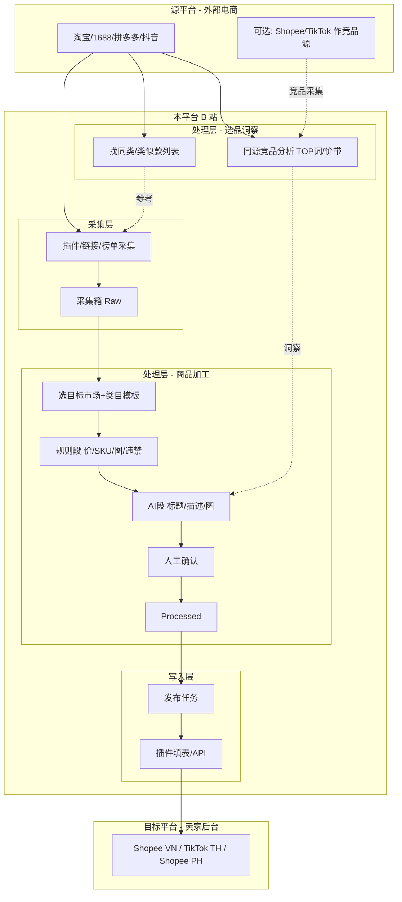

# 业务流程设计 v2.0（重基线）

> 日期：2026-05-30  
> 依据：原始调研资料 + [`REQUIREMENTS_V2_0.md`](./REQUIREMENTS_V2_0.md)  
> 目的：厘清 **源平台 / 目标平台 / 本平台（B 站）** 三者角色，并细化「处理层·同源找款」

---

## 1. 三个「平台」不要混

| 名称 | 是什么 | 例子 | 在本系统中的位置 |
|------|--------|------|------------------|
| **源平台（供货/选品侧）** | 采货源站、做竞品与找同款 | 淘宝、1688、拼多多、抖音；也可把 **Shopee/TikTok 当源** 做本土竞品采集 | 插件 content script、Worker 直采 |
| **目标平台（上架侧）** | 要写入的卖家后台 | 越南 Shopee、泰国 TikTok、菲律宾 Shopee | 插件填表 / Open API |
| **本平台（B 站）** | 我们的 Web + API，运营中枢 | `web/`、`api/` | 采集箱、工作台、发布中心 — **不是**「在淘宝上找同类」的那个平台 |

**纠正 v1 模糊点**

- 「在本平台找同类」❌ — 易误解为在 B 站数据库里随便搜。  
- 正确表述 ✅：**在某一源平台上**，按当前准备上架的品类/关键词，找 **同类/类似在售商品**（分析或采集），结果进入 B 站 **处理层** 供后续改写与定价参考。

---

## 2. 端到端业务流程（覆盖设计）



### 2.1 路径 A：先洞察再采集（推荐）

| 步骤 | 在哪发生 | 操作 | 产出 |
|------|----------|------|------|
| A1 | **源平台**（如淘宝） | 搜索品类词「儿童 T恤」 | — |
| A2 | **处理层·竞品分析**（B 站 `/app/competitors`） | 登记源平台+关键词，Mock/Worker 拉 TOP 标题词、价格带 | `CompetitorInsights` |
| A3 | **处理层·找同类**（B 站 竞品页 Tab） | 同源找类似在售链接 | `SimilarProduct[]` |
| A4 | **采集层** | 选定要上的链接，插件/直采 | `RawProduct` → 采集箱 |
| A5 | **处理层·工作台** | 挂载洞察 + 跑管线 | `ProcessedProduct` |
| A6 | **写入层** | 发布任务 + 填表 | 目标平台草稿 |

### 2.2 路径 B：先采集再补洞察

| 步骤 | 说明 |
|------|------|
| B1 | 插件已从 1688 采集进采集箱 |
| B2 | 工作台选商品 →「拉取同源洞察」用 `source`+`title` 反查 |
| B3 | 再跑管线、发布 |

### 2.3 路径 C：目标市场作源（本土竞品）

| 步骤 | 说明 |
|------|------|
| C1 | 源平台选 **TikTok 泰国** 或 **Shopee 越南** |
| C2 | 分析本土爆款标题风格（泰语/越南语） |
| C3 | 国内 1688 采集供货 → 处理时 **参考本土标题** 而非直译中文 |

---

## 3. 处理层职责拆分（核心）

处理层 **不是** 单一「AI 优化」，而是两块：

| 子模块 | 输入 | 输出 | 是否用 LLM |
|--------|------|------|------------|
| **3.1 同源洞察** | 源平台 + 关键词（+ 可选已采集商品） | 热词、价格带、样例标题 | 统计为主；标题归纳可 LLM |
| **3.2 找同类/类似款** | 同上 + 可选商品 URL | 同源平台在售列表（标题/价/链） | 检索/爬虫 Mock |
| **3.3 商品加工** | 采集箱 `RawProduct` + 洞察引用 | `ProcessedProduct` | 规则段否；模糊段是 |

**数据契约（处理层内部）**

```typescript
// 洞察（可独立于商品存在）
CompetitorInsights { sourcePlatform, keyword, keywords[], priceRange, sampleTitles[] }

// 同源类似款（仍在源平台，未入库或可选入库）
SimilarProduct { title, priceCny, sourceUrl, salesHint, thumb }

// 加工结果（面向目标市场）
ProcessedProduct { targetLocale, title, shortDescription, skus[], images[], insightsRef? }
```

---

## 4. 与 ERP（店八方类）流程对照

| ERP 手工步骤 | 本平台步骤 | 变化 |
|--------------|------------|------|
| ERP 内粘贴链接采集 | 插件/直采 → 采集箱 | 同源契约 `NormalizedProduct` |
| 人工逛淘宝看爆款 | **处理层·竞品+找同类** | 结构化洞察，可挂工作台 |
| ERP 内改标题/SKU/9 图 | 工作台：规则+AI+双栏 | 规则与 AI 分离 |
| ERP 一键翻译 | 管线 locale 段 | 内置 |
| ERP/后台发布 | 发布中心 + 插件填表 | 状态机可追踪 |

---

## 5. 页面与流程映射

| 流程步骤 | 路由 | 负责 Scope |
|----------|------|------------|
| 同源竞品分析 | `/app/competitors` | B + API Worker |
| 找同类（Tab） | `/app/competitors` | B + API |
| 采集入库 | `/app/inbox`、`/app/link-collect` | A 插件 + B |
| 商品加工 | `/app/workbench/:id` | B |
| 模板/规则 | `/app/templates`、`/app/rules` | B |
| 写入 | `/app/publish` | A 填表 + B 任务 |
| 设置 | `/app/settings` | v1 延续 |

---

## 6. v1 → v2 流程差异小结

| 项目 | v1 | v2（本文） |
|------|-----|------------|
| 竞品/找同类 | 无或混在洞察 Mock | **明确在源平台、归属处理层** |
| 「本平台」表述 | 易歧义 | 专指 B 站 |
| 选品 | 随意采集 | 可先 A2 再 A4 |
| 处理 | 管线一锅炖 | 洞察 / 规则 / AI 分段 |

---

*业务流程 v2.0 — 结束*
