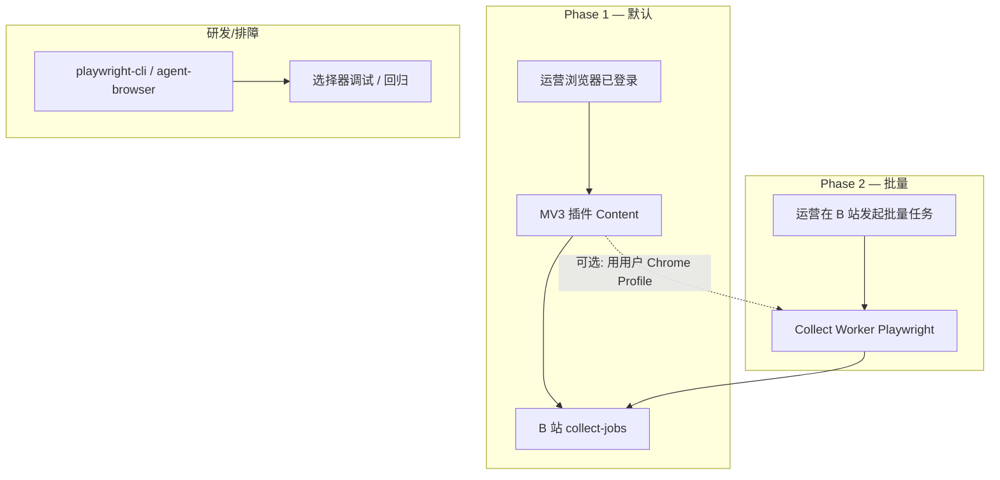

# 采集架构决策 — RPA / 插件 / CLI

> 版本：v0.1 · 2026-05-29  
> 状态：**已定方向**（与 `PROJECT_PLAN.md` Phase 1/2 对齐）

---

## 1. 结论（可直接拍板）

| 问题 | 建议 |
|------|------|
| 为「普遍适应」是否用 RPA？ | **部分合理**：用「浏览器自动化 + 分层提取」思路，但不要只做裸 DOM 点击；优先 JSON/API，RPA 作兜底 |
| 是否用 Chrome CLI（Playwright/agent-browser）？ | **适合服务端/研发**，不适合作为运营日常主路径；与插件 **互补** |
| 全自动批量爬前十 + 随机延迟？ | **可做，但放在 Worker 可选任务**，默认关闭；单次任务上限、需用户确认、限速与审计 |
| 主路径（Phase 1） | **MV3 插件：当前页确认采集** + B 站 `POST /collect-jobs` |
| 扩展路径（Phase 2） | **Collect Worker**（Playwright + Crawlee）处理链接列表/榜单批量 |

---

## 2. 三种形态对比



| 维度 | MV3 插件 | 服务端 RPA（Playwright Worker） | Chrome CLI（本机） |
|------|----------|--------------------------------|-------------------|
| 用户会话 | 真实已登录 Cookie | 需 Profile/Cookie 注入或重新登录 | 本机 Profile |
| 反检测 | 最接近真人 | 需 stealth + 行为模拟 | 同 Worker |
| 审核/合规 | 商店友好（最小权限） | 不涉及商店 | 仅内部 |
| 批量 TOP N | 不适合静默批量 | **适合** | 仅开发 |
| 维护成本 | 选择器热更新 | 脚本 + 队列 | 低（临时） |
| 普遍适应 | 单站深、多站靠配置 | 多站靠 Crawlee 路由 | 调试 |

**推荐组合：插件负责「人在回路」；Worker 负责「人发起后的批量」；CLI 不负责生产。**

---

## 3. 采集引擎分层（普遍适应的核心）

对任意商品页，按优先级尝试（与行业实践一致）：

| 层级 | 手段 | 稳定性 | 适用 |
|------|------|--------|------|
| L1 | 页面内嵌 JSON / `__INITIAL_STATE__` / XHR 拦截 | 高 | 1688、淘宝、Shopify 等 |
| L2 | `application/ld+json`（Schema.org Product） | 中高 | 部分 C 站、独立站 |
| L3 | 已知公开 API（Network 面板验证、合规使用） | 高 | 自有店、开放平台 |
| L4 | **RPA 式 DOM**（多选择器 fallback + 等待） | 低~中 | 兜底 |
| L5 | 截图 + 视觉/OCR（P2+） | 中 | 极端兜底 |

配置落在 B 站 `GET /extension/selectors`（插件）与 `GET /collect-adapters/{site}`（Worker），**同一套 NormalizedProduct 输出**。

---

## 4. 「类 RPA」在工程里指什么

不是采购 UiPath 类桌面 RPA，而是：

1. **真实浏览器上下文**（Chromium + 可选 rebrowser 补丁）
2. **确定性步骤脚本**：打开 URL → 等待选择器 → 滚动 → 提取 → 延迟 → 下一项
3. **人类行为噪声**：随机延迟、滚动、鼠标轨迹（批量 Worker 用）

### 4.1 批量 TOP10 行为参数（采纳你的设想，加护栏）

```typescript
// Collect Worker 任务配置示例
interface BatchCollectConfig {
  maxItems: 10;                    // 硬上限，可配置 5~20
  delayMsMin: 250;
  delayMsMax: 2400;
  scrollBeforeExtract: true;
  requireUserConfirm: true;        // B 站创建任务时勾选
  respectRobotsTxt: true;          // 能读则读
  stopOnCaptcha: true;             // 遇验证码暂停并通知
}
```

**必须同时满足：**

- 用户在 B 站点击「开始批量采集」（非插件静默跑）
- 任务写审计日志：`who / when / urls / success / fail_reason`
- 失败码：`captcha_required` | `rate_limited` | `selector_miss` | `auth_expired`
- Phase 1 **不做** 全自动批量，先跑通单页 + 链接解析

---

## 5. GitHub 参考项目（按用途）

### 5.1 编排与队列（服务端批量首选）

| 项目 | Stars | 用途 |
|------|-------|------|
| [apify/crawlee](https://github.com/apify/crawlee) | ~23k | **首选**：Playwright/Puppeteer 爬虫框架，重试、队列、指纹、存储 |
| [apify/crawlee-python](https://github.com/apify/crawlee-python) | ~9k | Python 版，适合 Worker 用 Python |

### 5.2 反检测（Worker 增强）

| 项目 | 说明 |
|------|------|
| [rebrowser/rebrowser-patches](https://github.com/rebrowser/rebrowser-patches) | 修补 Playwright/Puppeteer 的 CDP 泄漏（Runtime.enable 等） |
| [rebrowser/rebrowser-playwright](https://github.com/rebrowser/rebrowser-playwright) | Drop-in 替换 playwright |
| `playwright-stealth`（Python） | 基础指纹伪装；**不能单独对抗 Cloudflare** |

### 5.3 电商向示例（研究用，勿直接抄生产）

| 项目 | 说明 |
|------|------|
| [ortizdavidg/shopee-lazada-tiktok-scraper-crawler](https://github.com/ortizdavidg/shopee-lazada-tiktok-scraper-crawler) | 东南亚平台；偏对抗式爬取，合规风险高 |
| [rebrowser/shopee-dataset](https://github.com/rebrowser/shopee-dataset) | 数据集/字段参考 |

### 5.4 插件 + 自动化混合（思路参考）

| 来源 | 要点 |
|------|------|
| [Browser Frameworks + Chrome Extension hybrid](https://medium.com/@tonimaxx/browser-frameworks-meet-their-sidekick-how-my-chrome-extension-turbocharges-selenium-playwright-55827f91761b) | Playwright 编排 + Extension 执行 = 会话真实 + 可调度 |

### 5.5 Chrome CLI（仅开发/Agent 调试）

| 工具 | 用途 |
|------|------|
| [Playwright CLI](https://playwright.dev/docs/cli) | 官方：`open`、`screenshot`、codegen |
| `agent-browser`（Cursor 技能） | AI 驱动快照 + ref 点击；**适合你们调试选择器**，不上线 |
| `playwright-cli` 技能 | 终端自动化回归 |

**结论：CLI 写入 `scripts/collect-spike/`，不进入运营主流程。**

---

## 6. 推荐落地架构（电商助手）

```text
┌─────────────────────────────────────────────────────────┐
│ B 站 API                                                 │
│  POST /collect-jobs          ← 插件 / Worker 统一入口    │
│  POST /collect-jobs/batch    ← Phase 2 批量任务         │
│  GET  /extension/selectors   ← 插件热更新               │
│  GET  /collect-adapters/:site← Worker 站点脚本版本       │
└─────────────────────────────────────────────────────────┘
         ▲                              ▲
         │                              │
   ┌─────┴─────┐                 ┌──────┴──────┐
   │ MV3 插件   │                 │ Collect     │
   │ 单页确认   │                 │ Worker      │
   │ L1→L4 提取 │                 │ Crawlee +   │
   └───────────┘                 │ Playwright  │
                                 │ TOP N+延迟  │
                                 └─────────────┘
```

### Phase 1（当前继续）

- [ ] 插件：`extractProduct()` 实现 L1→L4 链
- [ ] 选择器服务端配置 + 版本号
- [ ] 不做静默批量

### Phase 2

- [ ] `collect-jobs/batch`：榜单 URL + `maxItems=10` + 延迟配置
- [ ] Worker：Crawlee `PlaywrightCrawler` + rebrowser 补丁
- [ ] 结果进采集箱，状态 `raw`，人工进工作台

### Phase 3

- [ ] 竞品洞察爬取与采集共用 Worker 池
- [ ] 能 API 的源站改 L3，减少 RPA 维护

---

## 7. 风险与产品策略

| 风险 | 对策 |
|------|------|
| 平台 ToS / 封号 | 用户自有账号；批量需确认；限速；不默认开启 |
| 选择器失效 | 适配器版本 + 采集成功率看板 |
| 验证码 | `stopOnCaptcha` + 通知运营手动处理 |
| 插件商店 | 批量放 Worker，插件保持「当前页助手」定位 |
| 法律合规 | 仅采用户有权访问的页面；隐私政策写清用途 |

---

## 8. 对你两个具体问题的直接回答

**Q：普遍适应是否用类似 RPA？**  
**A：合理，但实现为「分层提取 + Playwright Worker」，不是纯点击型 RPA。** 插件侧尽量 L1/L2，Worker 侧才上完整 RPA 行为（滚动、延迟、TOP N）。

**Q：是否用 Chrome CLI？**  
**A：用于开发与选择器回归，不用于生产采集。** 生产用 **Crawlee + Playwright（+ rebrowser-patches）** 的 Worker；运营侧仍用 **MV3 插件** 保持登录态与合规叙事。

**Q：全自动批量前十 + 250–2400ms 延迟？**  
**A：采纳，作为 Phase 2 Worker 的可选模式**，带确认、上限、审计；不作为插件默认行为。

---

## 9. 相关文档

- `EXTENSION_SPEC.md` — 插件采集与权限
- `API_OUTLINE.md` — `collect-jobs` 接口
- `ARCHITECTURE.md` — Collect Service / Worker
- `PROJECT_PLAN.md` — 里程碑
