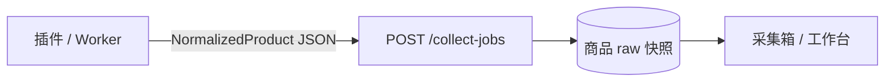

# 采集数据契约（NormalizedProduct）

> **唯一事实源**：本文件 + `shared/schemas/normalized-product.schema.json`  
> 插件、Web 原型、未来 API / Worker **必须**与此一致；字段变更须同时改三处并 bump 契约版本。

**契约版本**：`1.0.0`（Phase 1）

---

## 1. 是否拆成两个子任务？

**建议拆成两个并行子任务，但先冻结本契约，再各自开发。**

| 子任务 | 负责范围 | 交付物 |
|--------|----------|--------|
| **A. 插件** | MV3 采集、Popup、分层提取、上传 B 站 | `extension/` · 输出符合本契约的 JSON |
| **B. Web + API** | 采集箱、工作台、设置、collect-jobs API | `web/` · 接收/存储/展示同一 JSON |

**协作规则**

1. 契约变更由一人 PR，同时改：Schema、插件 `normalize.js`、Web `collectTypes.ts`、API 文档。
2. 插件与 Web 联调清单：在 1688、淘宝各采 1 条 → 采集箱字段一致（标题、价、图、L1/L2/L4）。
3. 禁止插件私有字段、禁止 Web 另起一套命名（如 `priceCny` 仅作 B 站内部展示字段，不入契约）。



---

## 2. 标准 payload（NormalizedProduct）

```json
{
  "source": "淘宝",
  "sourceUrl": "https://item.taobao.com/item.htm?id=123",
  "title": "韩版童装连衣裙夏季女童公主裙",
  "price": { "amount": 28.5, "currency": "CNY" },
  "images": ["https://img.alicdn.com/..."],
  "skus": [
    { "id": "sku-1", "name": "粉色 110cm", "price": 28.5 }
  ],
  "attributes": {
    "itemId": "123",
    "shopId": "456"
  },
  "capturedAt": "2026-05-29T12:00:00.000Z",
  "extractMethod": "json_embed",
  "extractLayer": "L1"
}
```

### 字段说明

| 字段 | 类型 | 必填 | 说明 |
|------|------|------|------|
| `source` | string | ✓ | 平台名：1688、淘宝、天猫、链接采集… |
| `sourceUrl` | string | ✓ | 商品页 URL |
| `title` | string | ✓ | 标题，非空 |
| `price.amount` | number | ✓ | 数字价格，未知填 0 |
| `price.currency` | string | ✓ | ISO 4217，默认 CNY |
| `images` | string[] | ✓ | 绝对 URL，可空数组 |
| `skus` | object[] | ✓ | `id`、`name` 必填；`price` 可选 |
| `attributes` | object | ✓ | 扩展属性，可 `{}` |
| `capturedAt` | ISO8601 | ✓ | 采集时间 |
| `extractMethod` | enum | | `json_embed` \| `json_ld` \| `dom` |
| `extractLayer` | enum | | `L1` \| `L2` \| `L4` |

---

## 3. 代码映射（实现位置）

| 层级 | 路径 | 说明 |
|------|------|------|
| JSON Schema | `shared/schemas/normalized-product.schema.json` | 机器可读校验 |
| 插件输出 | `extension/content/shared/normalize.js` | `buildProduct()` |
| Web 类型 | `web/src/lib/collectTypes.ts` | `NormalizedProduct` + `isNormalizedProduct()` |
| 演示导入 | `web/src/lib/inboxStore.ts` | `decodeDemoImport` → 内部 `CapturedProduct` |
| API（规划） | `POST /api/v1/collect-jobs` body.data | 与插件 payload 相同 |

### B 站内部模型（与契约区分）

采集箱列表可使用 **展示字段**（非上传契约）：

| 内部字段 | 来源 |
|----------|------|
| `priceCny` | `price.amount`（CNY 时） |
| `thumb` | `images[0]` 或占位图 |
| `category` | 默认「童装」或后续规则推断 |
| `status` | B 站状态机 `raw` |

`rawCapture` 建议保存完整 `NormalizedProduct` 快照，供工作台回放。

---

## 4. API 包络（未来）

```json
{
  "code": 0,
  "message": "ok",
  "data": {
    "jobId": "cj_xxx",
    "productId": "p_xxx",
    "normalized": { }
  }
}
```

`POST /collect-jobs` 请求体：

```json
{
  "schemaVersion": "1.0.0",
  "channel": "extension",
  "payload": { }
}
```

`payload` = 上表 NormalizedProduct（`{}` 处填完整对象）。

---

## 5. 变更流程

1. 提议变更 → 更新 `schemaVersion`（如 `1.1.0`）  
2. 改 `normalized-product.schema.json`  
3. 改插件 + Web + `API_OUTLINE.md`  
4. 插件与 Web 各跑 1 条 1688 + 1 条淘宝回归  

---

## 6. 相关文档

- `docs/COLLECT_ARCHITECTURE.md` — 采集架构与批量 Worker  
- `docs/EXTENSION_SPEC.md` — 插件行为  
- `docs/API_OUTLINE.md` — REST 纲要  
- `docs/DEV_SPLIT.md` — **双人异步开发、分支、PR、关联文件备注**  
