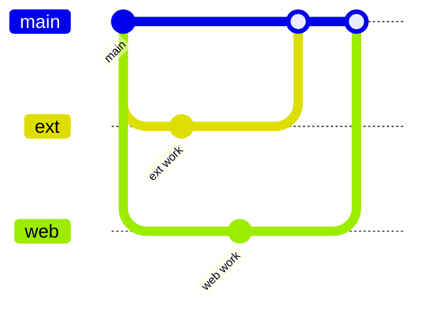

# 双人异步开发：插件 × Web 拆分与代码管理

> 适用：两人并行、沟通不同步。  
> **铁律**：采集数据只认 `docs/COLLECT_SCHEMA.md`（契约 v1.0.0）。

---

## 1. 任务拆分（建议 Issue / 里程碑）

### 子任务 A — 浏览器插件 `extension/`

| 优先级 | 内容 | 目录 | 不碰 |
|--------|------|------|------|
| P0 | 1688 / 淘宝 / 天猫 L1→L2→L4 提取 | `content/shared/adapters/` | `web/` |
| P0 | Popup 采集预览、上传采集箱 | `popup/` | |
| P1 | Background Token、队列、`POST collect-jobs` | `background/` | |
| P1 | 发布草稿填表（卖家后台） | `content/` 新 adapter | |
| P2 | 新源站 adapter | `adapters/*.js` | |

**交付定义**：`extractProduct()` 输出 JSON 通过 `shared/schemas/normalized-product.schema.json` 校验（可手测）。

---

### 子任务 B — Web + API `web/`（与未来 `api/`）

| 优先级 | 内容 | 目录 | 不碰 |
|--------|------|------|------|
| P0 | 采集箱导入、展示契约字段 | `lib/inboxStore.ts`, `pages/InboxPage.tsx` | `extension/` |
| P0 | 工作台 raw 快照、主图 | `pages/WorkbenchPage.tsx` | |
| P1 | 设置、大模型、插件下载 | `pages/SettingsPage.tsx` | |
| P1 | `POST /collect-jobs` 实现 | 未来 `api/` 或 mock | |
| P2 | 批量采集任务 UI | 对接 Worker | |

**交付定义**：`demoImport` 或 API 收到的 `payload` 与插件 JSON **字段一致**。

---

## 2. 关联部分（必须双人知情）

以下文件/概念 **跨边界**，改之前看本节，PR 里 `@` 对方或贴「契约变更」标签。

| 关联点 | 路径 | 备注标记 | 谁主责 | 规则 |
|--------|------|----------|--------|------|
| **数据契约** | `docs/COLLECT_SCHEMA.md` | 文档标题 | 共同 | 变更须双人 Review |
| **JSON Schema** | `shared/schemas/normalized-product.schema.json` | `$id` / `description` | 共同 | 与契约同步 bump 版本 |
| **插件输出** | `extension/content/shared/normalize.js` | 文件头 `COLLECT_SCHEMA` | A | 只输出契约字段 |
| **Web 类型** | `web/src/lib/collectTypes.ts` | `COLLECT_SCHEMA_VERSION` | B | 与 Schema 一致 |
| **演示导入** | `web/src/lib/inboxStore.ts` | `decodeDemoImport` | B | 解析契约，内部可转 `CapturedProduct` |
| **采集架构** | `docs/COLLECT_ARCHITECTURE.md` | — | 共同 | Worker/批量与插件接口 |
| **API 纲要** | `docs/API_OUTLINE.md` 采集段 | — | B 主笔 | A 审 `collect-jobs` body |
| **演示 ZIP** | `web/public/downloads/*.zip` | prebuild 生成 | A 改 extension 后跑 `npm run zip:extension` | B 合 PR 前确认能下 |

代码里已用注释指向契约（搜索 `COLLECT_SCHEMA` 可列出全部关联文件）。

---

## 3. 异步开发：分支与合并

### 3.1 分支命名

```text
feat/ext-1688-sku          # 插件
feat/web-inbox-import      # Web
docs/collect-schema-1.1    # 契约变更（两人都要看）
fix/ext-taobao-price       # 插件修复
```

### 3.2 推荐流程



1. 从 `main` 拉分支，**每日 rebase `main`**（减少大冲突）。  
2. **契约变更**：单独 PR `docs/collect-schema-*`，先合并，两人再 rebase。  
3. 插件 PR 不要求 Web 改代码；Web PR 不要求插件改代码。  
4. 联调：插件 PR 描述里贴一条 **NormalizedProduct 样例 JSON**；Web 用该 JSON 测 `demoImport`。

### 3.3 禁止

- 在 `extension/` 里改 `web/src/`（反之亦然），除非契约 PR。  
- 单方面重命名字段（如 `price` → `priceCny` 只出现在契约层）。  
- 长期分支超过 3 天不 rebase `main`。

---

## 4. 代码仓库目录所有权（参考）

| 目录 | 主责 | 说明 |
|------|------|------|
| `extension/` | 开发者 A | 插件唯一工作区 |
| `web/` | 开发者 B | B 站前端 |
| `shared/schemas/` | 共同 | 只放契约 Schema |
| `docs/COLLECT_*.md` | 共同 | 采集相关设计 |
| `docs/PROJECT_PLAN.md` 等 | 共同 | 产品方向 |
| `scripts/zip-extension.mjs` | A 执行，B 可跑 | 打包演示 ZIP |

可选：启用 `.github/CODEOWNERS` 自动 @ 负责人 Review。

---

## 5. PR 检查清单（复制到 PR 描述）

### 插件 PR

- [ ] 输出符合 `normalized-product.schema.json` v1.0.0  
- [ ] 未新增契约外顶层字段  
- [ ] 已附 1688 或淘宝 **样例 JSON**（可脱敏）  
- [ ] 若改 `normalize.js` / adapter，未改 `web/`  
- [ ] 已跑 `npm run zip:extension`（若改 extension）

### Web PR

- [ ] `collectTypes.ts` 与 Schema 一致  
- [ ] `inboxStore` 保存 `rawCapture` 完整快照  
- [ ] 未改 `extension/`（除非契约 PR）  
- [ ] `npm run lint` / `npm run build` 通过  

### 契约变更 PR（`schemaVersion` bump）

- [ ] 更新 `COLLECT_SCHEMA.md` 变更说明  
- [ ] 更新 `normalized-product.schema.json`  
- [ ] 更新 `collectTypes.ts` + `normalize.js`  
- [ ] 更新 `API_OUTLINE.md`（如有）  
- [ ] **两人 Approve** 后再合并  

---

## 6. 沟通最小集（不必实时开会）

| 事件 | 动作 |
|------|------|
| 契约要加字段 | 开 Issue「schema 1.1」+ 样例 JSON，停其他采集 PR |
| 插件适配新站 | Issue 写清域名；Web 无需改 |
| Web 改采集箱列 | 只动内部 `CapturedProduct`，不动契约 |
| 联调失败 | 对比插件 JSON vs Schema；贴两边截图 |

---

## 7. 本地联调（无需后端）

1. A：`web` 下 `npm run dev`，B 站 `http://localhost:3004`  
2. 插件「后台地址」填 localhost  
3. A：源站采集 → 上传  
4. B：看采集箱是否导入、字段是否齐  

生产：`https://tuerqidelvfanzi.github.io/E-comassit-plan`

---

## 8. 相关文件速查

```bash
# 列出所有契约关联注释
rg "COLLECT_SCHEMA" extension web docs shared
```

| 文档 | 用途 |
|------|------|
| `docs/COLLECT_SCHEMA.md` | 字段定义 |
| `docs/COLLECT_ARCHITECTURE.md` | 插件 vs Worker |
| `docs/EXTENSION_SPEC.md` | 插件行为 |
| `docs/DEV_SPLIT.md` | 本文 |
