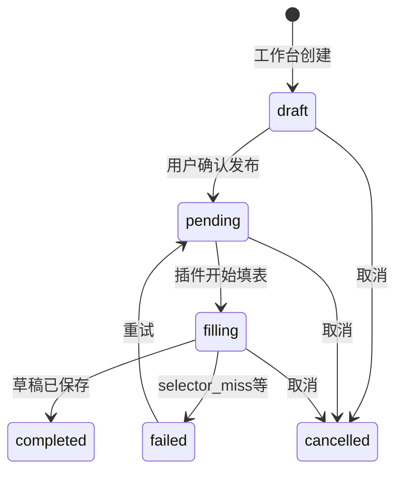
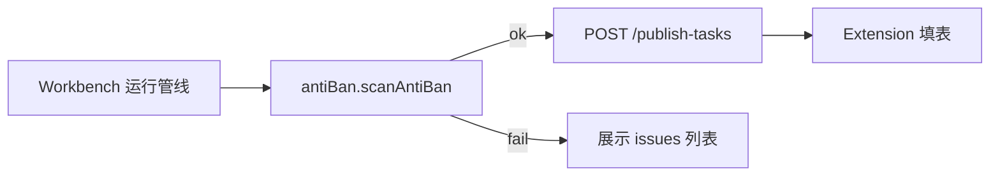
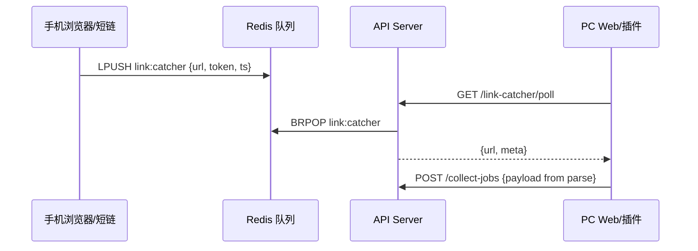
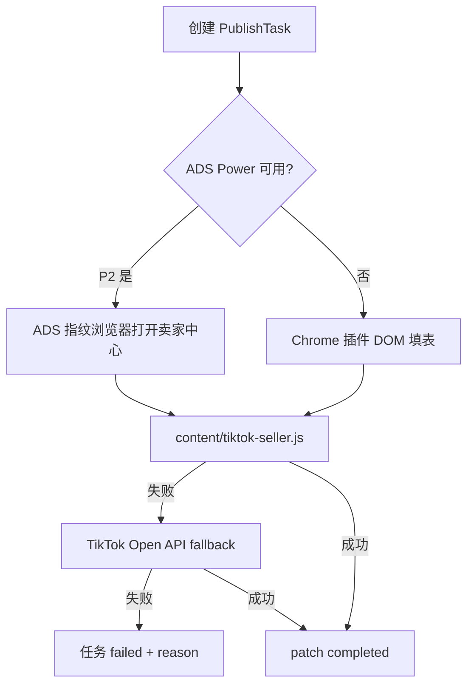
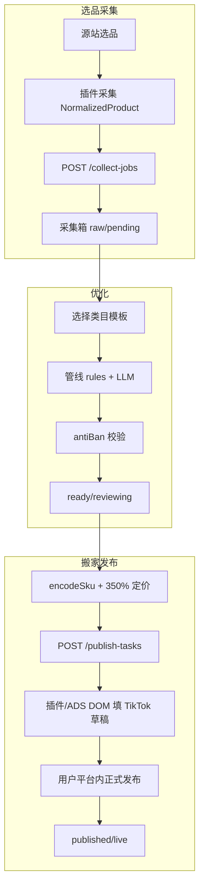

# 上架发布功能 — 实现规格

> 版本：v1.0 · 2026-05-30  
> 依据：《跨境电商 AI 上架助手开发需求文档》§2–5、§7–8  
> 关联：`docs/BUSINESS_REQUIREMENTS_DEV.md`、`docs/SCOPE_FEATURES.md`、`docs/EXTENSION_SPEC.md`

---

## 1. 概述

本文档将 BRD「选品 → 采集 → 优化 → 搬家（上架发布）」中的**发布层**细化为可落地的模块设计、数据模型、API 契约与分阶段路线图。当前代码库已有采集契约、处理管线雏形、淘宝 DOM 填表与基础 `publish-tasks` API；本文档补齐 **SKU 编码、防封校验、TikTok 发布、定价/物流默认值、状态机映射** 等 BRD 要求。

---

## 2. 差距分析（Gap Analysis）

### 2.1 已有能力

| 领域 | 现状 | 主要路径 |
|------|------|----------|
| 采集契约 | NormalizedProduct v1.0.0 | `docs/COLLECT_SCHEMA.md`、`shared/schemas/` |
| 处理管线 | 规则 + mock LLM、VN/TH 定价 | `shared/pipeline/engine.ts` |
| 发布任务 API | CRUD 三态 pending/completed/failed | `api/src/app.ts` L405–466 |
| 淘宝填表 | 标题/价/库存 DOM fallback | `extension/content/publish-fill.js`、`shared/selectors/taobao-seller.json` |
| 发布中心 UI | 列表 + 新建任务 + 标记完成 | `web/src/pages/PublishPage.tsx` |
| 选择器热更新 | GET `/extension/selectors`（含 tiktok 占位） | `api/src/app.ts` L75–82 |

### 2.2 BRD 要求 vs 缺口

| BRD 要求 | 缺口 | 优先级 |
|----------|------|--------|
| 平台状态 Pending/Draft/Reviewing/Live/Suspended | DB 仍用 raw/ready/published；无 Suspended | P1 映射层 ✅ 脚手架 |
| 发布任务 draft→pending→filling→completed | API/Web 仅三态 | P1 |
| SKU 编码 01T-C10-M-G0012-B | 无编码器 | P0 ✅ `shared/listing/skuEncoder.ts` |
| White Hook 白钩款变体 | 无 | P0 ✅ `tiktokDefaults.ts` |
| 防封：Polyester vs Cotton 负向扫描 | 仅有通用违禁词 | P0 ✅ `shared/listing/antiBan.ts` |
| 定价进价×350%、No Brand | 管线用 VN/TH 公式，非 TikTok 350% | P0 ✅ 默认值模块 |
| 详情图固定 4 张顺序 | 无槽位定义 | P1 ✅ `DETAIL_IMAGE_SEQUENCE` |
| TikTok DOM 填表 + Open API fallback | 占位选择器，无 content script | P1 |
| ADS Power 指纹浏览器 gate | 无 | P2 |
| Redis 手机链抓取 + PC 同步 | 无 | P2 |
| AI 图片 pipeline（去水印/模特图） | 无 | P2 |
| publish_tasks 扩展字段 price/images/skus | schema 缺列 | P1 |

---

## 3. 数据模型

### 3.1 双轨状态：采集箱 vs 平台上架

**原则**：不破坏现有 `products.status`（`raw|processing|ready|published`），BRD 平台状态通过**映射层**展示。

| 采集箱 status（DB） | 平台 ListingStatus（UI/报表） | 含义 |
|---------------------|-------------------------------|------|
| `raw` | `pending` | 待处理/待优化 |
| `processing` | `draft` | 管线运行中或草稿编辑 |
| `ready` | `reviewing` | 可发布，待审核/填表 |
| `published` | `live` | 已在目标平台上架 |
| — | `suspended` | 平台侧下架/违规（P1 新增字段或 publish 回写） |

实现：`shared/listing/status.ts`、`web/src/lib/api/types.ts` 中 `PRODUCT_TO_LISTING_STATUS`。

### 3.2 发布任务状态机



代码：`PublishTaskStatus` + `canTransitionPublishTask()`。

### 3.3 SKU 编码（服装-T恤）

格式：`{PREFIX}{COLOR_CODE}-{SIZE}-{SEQUENCE}-{VARIANT_SUFFIX}`

| 段 | 示例 | 说明 |
|----|------|------|
| PREFIX | `01T` | 模板固定前缀 |
| COLOR_CODE | `C10` | 白色（见 BRD 附录 B 色表） |
| SIZE | `M` | 尺码码表 |
| SEQUENCE | `G0012` | 商品序号，4 位 |
| VARIANT_SUFFIX | `B` / `H` | 白底黑印 / 黑底白印 |

**White Hook**：`WHITE_HOOK_VARIANT.skuSuffix = 'WH'`，`allowPolyesterListing: true`，材质强制 Polyester。

实现：`shared/listing/skuEncoder.ts`。

### 3.4 PublishTask 载荷（扩展，P1 migration）

```typescript
interface PublishTaskPayload {
  id: string;
  productId: string;
  platform: 'TikTok Shop' | 'Shopee' | '淘宝';
  status: PublishTaskStatus;
  title: string;
  description: string;
  price: number;
  currency: string;
  brand: string;              // 默认 "No Brand"
  images: ProductImage[];
  skus: Array<{
    skuCode: string;          // encodeSku() 输出
    color: string;
    size: string;
    price: number;
    stock: number;
  }>;
  logistics: typeof LOGISTICS_DEFAULTS;
  detailImageSlots: typeof DETAIL_IMAGE_SEQUENCE;
  channel: 'extension_dom' | 'open_api' | 'ads_power';
  reason?: string;
  retryCount: number;
}
```

---

## 4. 模块拆分与文件路径

### 4.1 Shared（契约 + 纯函数）

| 模块 | 路径 | 职责 |
|------|------|------|
| 状态机 | `shared/listing/status.ts` | Listing/Publish 状态与转换 |
| SKU 编码 | `shared/listing/skuEncoder.ts` | 编码/解析/色表 |
| 防封校验 | `shared/listing/antiBan.ts` | Cotton/Polyester 负向扫描 |
| TikTok 默认 | `shared/listing/tiktokDefaults.ts` | 350% 定价、物流、White Hook、4 图序 |
| TikTok 选择器 | `shared/selectors/tiktok-seller.json` | DOM 填表配置 |
| 测试 | `shared/listing/*.test.ts` | Vitest |

### 4.2 API（Scope-B 后端）

| 模块 | 路径 | 职责 |
|------|------|------|
| Domain 入口 | `api/src/domain/listing.ts` | 重导出 shared/listing |
| 发布服务 | `api/src/services/publish.ts` **新增 P1** | 创建任务、校验 antiBan、写 DB |
| 路由扩展 | `api/src/app.ts` | 扩展 publish-tasks body/schema |
| Migration | `api/src/db/schema.sql` | publish_tasks 增列 |
| 选择器加载 | `api/src/worker/selectors.ts` | 加载 tiktok-seller.json |

### 4.3 Web（Scope-B 前端）

| 模块 | 路径 | 职责 |
|------|------|------|
| 类型 | `web/src/lib/api/types.ts` | ListingStatus 映射 ✅ |
| 发布页 | `web/src/pages/PublishPage.tsx` | 展示 filling/failed、SKU 预览 P1 |
| 工作台 | `web/src/pages/WorkbenchPage.tsx` | 创建任务前 antiBan 提示 P1 |
| API 客户端 | `web/src/lib/api/index.ts` | 新端点封装 P1 |

### 4.4 Extension（Scope-A）

| 模块 | 路径 | 职责 |
|------|------|------|
| 填表脚本 | `extension/content/publish-fill.js` | 扩展 TikTok 分支 P1 |
| TikTok content | `extension/content/tiktok-seller.js` **新增 P1** | 专用填表 + SKU 表 |
| Background | `extension/background/service-worker.js` | 拉 pending 任务、ADS gate P2 |
| ADS 桥接 | `extension/background/adsPowerBridge.js` **新增 P2** | 调 ADS Power Local API |

### 4.5 Pipeline 规则引擎扩展

在 `shared/pipeline/engine.ts` 或独立 `shared/listing/rules.ts`（P1）：

1. **pricing_tiktok**：`calcTikTokListPrice(costCny)`
2. **safety_material**：`validateMaterialConsistency()`
3. **title_no_brand**：追加/替换 brand 为 `No Brand`
4. **detail_images**：`orderDetailImages()` 固定 4 槽

---

## 5. 防封素材校验（Anti-ban）

### 5.1 规则

| 场景 | 行为 |
|------|------|
| 源站 Cotton + 上架 Polyester 宣称 | **error**，阻断发布 |
| 源站 Polyester + 上架 Cotton 宣称 | **error** |
| White Hook 款 | 允许 Polyester，**禁止** Cotton 宣称 |
| 品牌/虚假宣传词 | **error**（耐克、最便宜等） |

### 5.2 集成点



- **P0**：纯函数 + 单元测试 ✅  
- **P1**：`POST /publish-tasks` 前服务端强制校验  
- **P1**：工作台 UI 展示 `issues[]`

---

## 6. Redis 手机链抓取 + PC 同步（Phase 2）

> 当前仓库**无 Redis**；Phase 2 独立服务，不阻塞 P0/P1。

### 6.1 架构



### 6.2 API 契约（规划）

| Method | Path | 说明 |
|--------|------|------|
| POST | `/link-catcher/enqueue` | 手机端写入（HMAC 签名） |
| GET | `/link-catcher/poll` | PC 长轮询或 SSE |
| DELETE | `/link-catcher/:id` | 消费确认 |

环境变量：`REDIS_URL`、`LINK_CATCHER_SECRET`。

---

## 7. AI 图片 Pipeline 挂钩（Phase 2）

### 7.1 占位接口

| Hook | 触发 | 输出 |
|------|------|------|
| `POST /products/:id/images/watermark-remove` | 用户点击 | `imageId`, `status: queued` |
| `POST /products/:id/images/model-generate` | 模板选「模特图」 | Job ID |
| Worker | 异步 | 更新 `ProductImage.status` → `processed` |

### 7.2 与详情图序集成

`DETAIL_IMAGE_SEQUENCE` 槽位 2（fabric_detail）、3（model_front）优先消费 AI 产物 URL；失败时回退原图。

---

## 8. TikTok 发布

### 8.1 策略优先级



### 8.2 DOM 填表（P1）

- 配置：`shared/selectors/tiktok-seller.json`
- 扩展 `publish-fill.js` 或独立 `tiktok-seller.js`：
  - 标题、价格（`calcTikTokListPrice`）、库存
  - Brand → 选「No Brand」或输入框填 `No Brand`
  - 物流默认值填入 weight/L×W×H
  - SKU 表：按 `skus[]` 逐行（需实测选择器）

### 8.3 Open API Fallback（P2）

- 凭据：Settings 页存储 shop_id、access_token（加密）
- `api/src/services/tiktokOpenApi.ts`：create product draft
- 失败码映射：`validation_error` → 回写 `publish_tasks.reason`

### 8.4 ADS Power Gate（P2）

- 检测 Local API（默认 `http://local.adspower.net:50325`）
- Background：`launchProfile(profileId)` → 获取 debugger 地址 → 注入 content script
- 无 ADS 时降级普通 Chrome 插件（用户确认风险提示）

---

## 9. 定价、物流、品牌

| 项 | BRD 规则 | 实现 |
|----|----------|------|
| TikTok 售价 | 进价 × **350%** | `TIKTOK_PRICE_MULTIPLIER = 3.5` |
| 品牌 | **No Brand** | `NO_BRAND` 常量，填表 + API |
| 物流 | 默认重量/尺寸 | `LOGISTICS_DEFAULTS` |
| 东南亚其他 | 2–3x + 汇率 | 保留 `pipeline/engine.ts` VN/TH 规则 |

---

## 10. 详情图序列（4 张固定）

| Slot | assetKey | 用途 |
|------|----------|------|
| 1 | `size_chart` | 尺码表 |
| 2 | `fabric_detail` | 面料细节 |
| 3 | `model_front` | 模特正面 |
| 4 | `selling_points` | 卖点/场景 |

函数：`orderDetailImages(images, fixedAssets)` — 先插槽位资产，不足 4 张用商品图补齐。

---

## 11. 端到端流程（对齐 BRD §6）



---

## 12. 分阶段路线图

### P0（当前迭代 — 脚手架 + 规格）

| 交付 | Scope | 状态 |
|------|-------|------|
| 本实现规格 | docs | ✅ |
| status / skuEncoder / antiBan / tiktokDefaults | shared | ✅ |
| Vitest 单测 | shared | ✅ |
| types 映射注释 | web | ✅ |
| tiktok-seller.json 占位 | shared | ✅ |

### P1（4–6 周 MVP 闭环）

| 交付 | Scope-A | Scope-B |
|------|---------|---------|
| publish_tasks DB 扩展 | — | B |
| POST publish 含 skus/images + antiBan | — | B |
| PublishPage 完整状态 UI | — | B |
| TikTok content script DOM 填表 | A | — |
| 管线接入 material + 350% 规则 | — | B |
| 详情图 4 槽 UI | — | B |

### P2（增强）

| 交付 | 说明 |
|------|------|
| Redis link catcher | 手机→PC 采集 |
| TikTok Open API fallback | 无 DOM 时 |
| ADS Power gate | 指纹浏览器 |
| AI 图片 Worker | 去水印/模特 |
| Suspended 状态回写 | 平台 webhook 或手动 |

---

## 13. API 端点增补表

| Method | Path | 阶段 | 说明 |
|--------|------|------|------|
| POST | `/publish-tasks` | P1 | Body 扩展：description, price, currency, images, skus, logistics, channel |
| PATCH | `/publish-tasks/:id` | P1 | status 增 `draft|filling|cancelled`；reason, retryCount |
| GET | `/publish-tasks/:id` | P1 | 完整载荷含 SKU 编码 |
| POST | `/publish-tasks/:id/validate` | P1 | 仅跑 antiBan + SKU，不写库 |
| POST | `/products/:id/sku/encode` | P1 | 批量生成 skuCode |
| GET | `/extension/selectors` | P1 | 返回 tiktok-seller.json 完整结构 |
| POST | `/link-catcher/enqueue` | P2 | Redis 入队 |
| GET | `/link-catcher/poll` | P2 | PC 同步 |
| POST | `/products/:id/images/watermark-remove` | P2 | AI 去水印 |
| POST | `/integrations/tiktok/oauth` | P2 | Open API 授权 |
| POST | `/integrations/adspower/profiles` | P2 | ADS Profile 列表 |

详见 `docs/API_OUTLINE.md` 发布章节附录。

---

## 14. 测试策略

### 14.1 单元测试（Vitest）

| 模块 | 用例 |
|------|------|
| `status.test.ts` | 状态映射、非法转换拒绝 |
| `skuEncoder.test.ts` | BRD 示例 01T-C10-M-G0012-B、未知色抛错 |
| `antiBan.test.ts` | Cotton/Polyester 冲突、White Hook 允许涤纶 |

运行：`cd api && npm test`（含 `../shared/listing/**/*.test.ts`）。

### 14.2 API 集成测试（P1）

- 创建 publish-task → antiBan 失败返回 422
- PATCH filling → completed 合法；completed → pending 非法

### 14.3 插件 E2E（P1）

- TikTok 卖家中心「新建商品」页：填标题/价/No Brand（Playwright 或人工清单）
- 失败回传 `selector_miss` → B 站展示 reason

### 14.4 回归

- 现有 `shared/pipeline/engine.test.ts` 不受影响
- Web `PublishPage` 仍兼容 API 三态 pending/completed/failed

---

## 15. 相关文档

| 文档 | 内容 |
|------|------|
| `docs/BUSINESS_REQUIREMENTS_DEV.md` | BRD 业务需求 |
| `docs/COLLECT_SCHEMA.md` | 采集契约 |
| `docs/SCOPE_FEATURES.md` | Scope-A/B 分工 |
| `docs/EXTENSION_SPEC.md` | 插件发布流程 |
| `docs/API_OUTLINE.md` | REST 端点 |

---

*文档结束*
