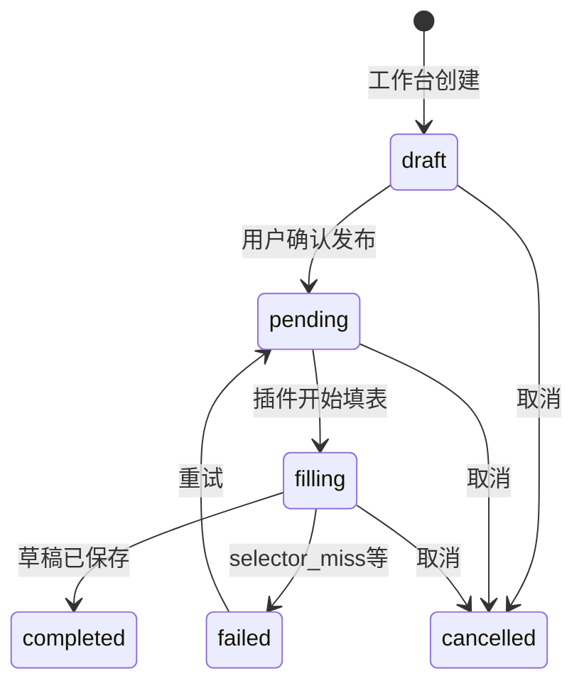
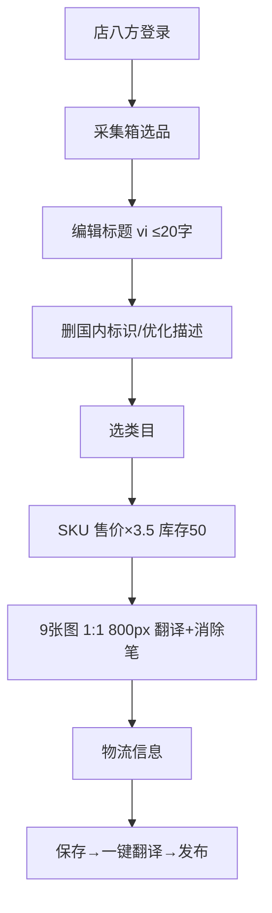
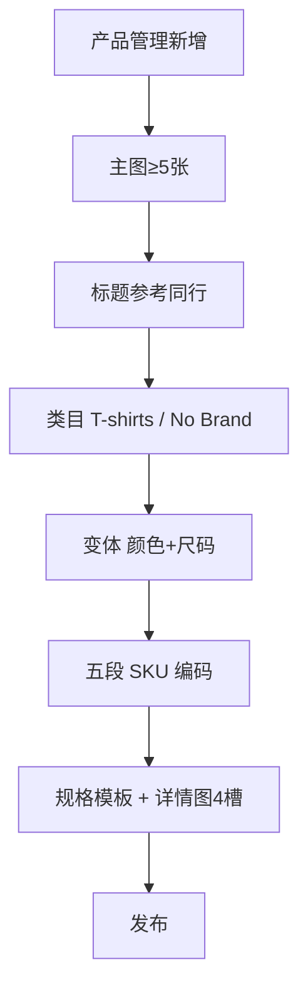
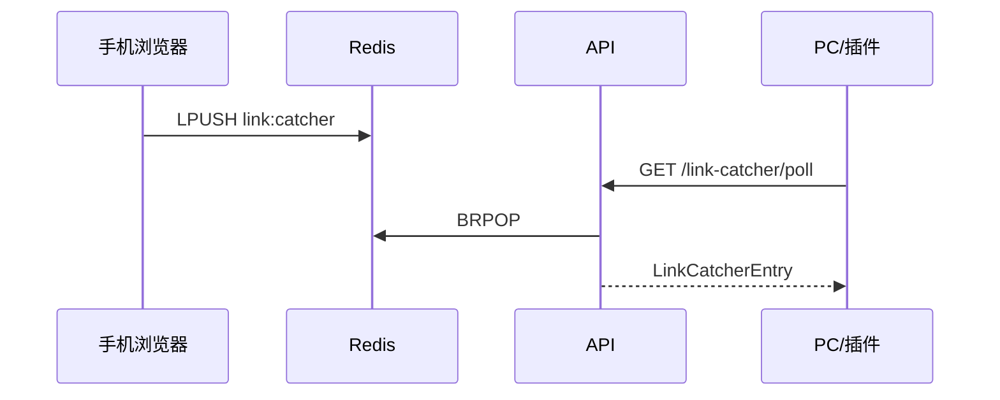

# 上架发布功能 — 实现规格

> 版本：v1.1 · 2026-05-30  
> 依据：`docs/BUSINESS_REQUIREMENTS_DEV.md` v1.1、`docs/SCOPE_FEATURES.md`、`docs/EXTENSION_SPEC.md`  
> 关联：`docs/BUSINESS_REQUIREMENTS_TRACEABILITY.md`

---

## 1. 概述

本文档将 BRD「选品 → 采集 → 优化 → 搬家（上架发布）」细化为可落地的模块设计、数据模型、API 契约与分阶段路线图。v1.1 已对齐 BRD 中**越南 Shopee** 与**泰国 TikTok** 双平台上品流程、五段 SKU 编码、分市场定价、图片/标题规则及 Phase 2 集成契约。

---

## 2. 差距分析（Gap Analysis）

### 2.1 已有能力

| 领域 | 现状 | 主要路径 |
|------|------|----------|
| 采集契约 | NormalizedProduct v1.0.0 | `docs/COLLECT_SCHEMA.md`、`shared/schemas/` |
| 处理管线 | 规则 + mock LLM、VN/TH 定价 | `shared/pipeline/engine.ts` |
| 发布任务 API | CRUD 三态 pending/completed/failed | `api/src/app.ts` |
| 淘宝填表 | 标题/价/库存 DOM fallback | `extension/content/publish-fill.js` |
| 发布中心 UI | 列表 + 新建任务 | `web/src/pages/PublishPage.tsx` |
| Listing 纯函数 | 状态机、SKU、定价、防封、契约 | `shared/listing/*` ✅ v1.1 |

### 2.2 BRD v1.1 要求 vs 缺口

| BRD 要求 | 实现状态 | 模块/路径 |
|----------|----------|-----------|
| 五段 SKU `{PREFIX}-{SEQ}-{SIDE}-{COLOR}-{SIZE}` | ✅ 纯函数 | `shared/listing/skuEncoder.ts` |
| White Hook `{PREFIX}-9999-P-WH-{SIZE}` 价400/库存5/重220g | ✅ | `skuEncoder.ts`、`categoryTemplates.ts` |
| 越南 Shopee 标题 ≤20 字、汉字压缩 | ✅ 校验 | `shared/listing/titleRules.ts` |
| 越南 x3.5、泰国 TikTok x2.5、菲律宾固定500 | ✅ | `shared/listing/marketPricing.ts` |
| 越南库存50、菲律宾800、重量220g | ✅ | `marketPricing.ts` |
| 图片9张(Shopee)/5张(TikTok)、敏感词扫描 | ✅ | `shared/listing/imageRules.ts` |
| 类目模板 tpl-clothing-tshirt 等 8 种 | ✅ 常量 | `shared/listing/categoryTemplates.ts` |
| 违禁品牌/国内标识扩展 | ✅ | `shared/listing/antiBan.ts` |
| 选品 GMV/CTR 筛选钩子 | ✅ 类型+函数 | `shared/listing/productFilters.ts` |
| Redis link catcher / ADS Power / AI 图片 / 计费 | ✅ 契约类型 | `shared/listing/contracts.ts` |
| TargetLocale id-ID、fil-PH | 📋 类型待 web/types | P1 |
| ProductImage.sensitiveContent 持久化 | 📋 DB/API | P1 |
| ProcessedOutput.shortDescription/charCount | 📋 管线输出 | P1 |
| publish_tasks 扩展 skus/images/logistics | 📋 migration | P1 |
| TikTok/Shopee DOM 填表 | 📋 | P1 Scope-A |
| Redis / ADS / AI Worker 运行时 | 📋 | P2 |

---

## 3. 数据模型

### 3.1 双轨状态：采集箱 vs 平台上架

**原则**：不破坏现有 `products.status`（`raw|processing|ready|published`），BRD 平台状态通过映射层展示。

| 采集箱 status | ListingStatus（UI） | 含义 |
|---------------|---------------------|------|
| `raw` | `pending` | 待处理/待优化 |
| `processing` | `draft` | 管线运行中或草稿编辑 |
| `ready` | `reviewing` | 可发布，待审核/填表 |
| `published` | `live` | 已在目标平台上架 |
| — | `suspended` | 平台侧下架/违规（P1 回写） |

实现：`shared/listing/status.ts`。

### 3.2 发布任务状态机



### 3.3 SKU 编码（BRD §4.2 服装-T恤）

格式：`{PREFIX}-{SEQUENCE}-{SIDE}-{COLOR}-{SIZE}`

| 段 | 示例 | 说明 |
|----|------|------|
| PREFIX | `BF` | 店铺名前缀 |
| SEQUENCE | `0001` | 0001–1000 |
| SIDE | `PR` | P/R/PR 正反面图案 |
| COLOR | `WH` | WH/BK/RD/BL… 见色表 |
| SIZE | `S` | S–XXXL |

**White Hook**（单款式占位）：`BF-9999-P-WH-M`，price=400，stock=5，weight=220g。

实现：`encodeSku()`、`encodeDummyHookSku()` — `shared/listing/skuEncoder.ts`。

### 3.4 分市场定价（BRD §7）

| 市场 | 平台 | 公式 | 默认库存 | 默认重量 |
|------|------|------|----------|----------|
| vn-shopee | Shopee | ×3.5 | 50 | 220g |
| th-tiktok | TikTok | ×2.5 | 50 | 220g |
| ph-shopee | Shopee | 固定500 | 800 | 220g |
| id-shopee | Shopee | ×3.5 | 50 | 220g |

实现：`calcListPrice()` — `shared/listing/marketPricing.ts`。

### 3.5 PublishTask 载荷（扩展，P1 migration）

```typescript
interface PublishTaskPayload {
  id: string;
  productId: string;
  platform: 'TikTok Shop' | 'Shopee' | '淘宝';
  status: PublishTaskStatus;
  title: string;
  shortDescription?: string;   // BRD §5.5 越南站
  description: string;
  price: number;
  currency: string;
  brand: string;               // 默认 "No Brand"
  images: ProductImage[];
  skus: Array<{
    skuCode: string;
    color: string;
    size: string;
    price: number;
    stock: number;
    weight?: number;
    patternSuffix?: 'P' | 'R' | 'PR';
    isDummyHook?: boolean;
  }>;
  logistics: typeof LOGISTICS_DEFAULTS;
  detailImageSlots: typeof DETAIL_IMAGE_SEQUENCE;
  channel: 'extension_dom' | 'open_api' | 'ads_power';
  targetMarket?: TargetMarket;
  reason?: string;
  retryCount: number;
}
```

---

## 4. 模块拆分与文件路径

### 4.1 Shared（契约 + 纯函数）

| 模块 | 路径 | 职责 |
|------|------|------|
| 状态机 | `shared/listing/status.ts` | Listing/Publish 状态与转换 |
| SKU 编码 | `shared/listing/skuEncoder.ts` | 五段编码/White Hook |
| 市场定价 | `shared/listing/marketPricing.ts` | 分国家倍率/库存/重量 |
| 标题规则 | `shared/listing/titleRules.ts` | 越南 20 字限制 |
| 图片规则 | `shared/listing/imageRules.ts` | 9/5 张、敏感内容 |
| 类目模板 | `shared/listing/categoryTemplates.ts` | tpl-* 定义与 SkuConfig |
| 防封校验 | `shared/listing/antiBan.ts` | 面料/品牌/国内标识 |
| TikTok 默认 | `shared/listing/tiktokDefaults.ts` | 物流、详情图序、White Hook |
| 选品筛选 | `shared/listing/productFilters.ts` | GMV/CTR 阈值 |
| Phase2 契约 | `shared/listing/contracts.ts` | Redis/ADS/AI/计费类型 |
| 测试 | `shared/listing/*.test.ts` | Vitest（41 用例） |

### 4.2 API Domain

| 模块 | 路径 | 职责 |
|------|------|------|
| 重导出 | `api/src/domain/listing.ts` | 与 shared 同步 |
| 镜像 | `api/src/domain/listing/*.ts` | 编译用副本 |

### 4.3 Web / Extension / Pipeline

（同 v1.0，P1 接入 antiBan、marketPricing、titleRules 校验 UI）

---

## 5. 平台流程（对齐 BRD）

### 5.1 越南 Shopee（BRD §3）



### 5.2 泰国 TikTok（BRD §4）



---

## 6. 防封素材校验

| 场景 | 行为 |
|------|------|
| Cotton ↔ Polyester 不一致 | **error** |
| White Hook | 允许 Polyester，禁止 Cotton 宣称 |
| 品牌（Nike/Gucci/LV/Apple/NASA…） | **error** |
| 国内标识（3C认证、产地、发货地） | **error** |

集成：Workbench 管线 → `antiBan.scanAntiBan` → `POST /publish-tasks`（P1 服务端强制）。

---

## 7. Phase 2 集成契约

### 7.1 Redis Link Catcher



类型：`LinkCatcherEntry`、`LinkCatcherEnqueueRequest` — `contracts.ts`。

### 7.2 ADS Power Gate

`evaluateAdsPowerGate(pingOk, profiles)` → `{ available, profiles, reason }`  
默认 Local API：`http://local.adspower.net:50325`。

### 7.3 AI 图片 Pipeline

| JobType | 说明 |
|---------|------|
| `watermark_remove` | 消除笔/去水印 |
| `model_generate` | 模特图 |
| `translate_overlay` | 中→越/泰翻译 |

配置：`DEFAULT_AI_IMAGE_CONFIG`，输出 800×800。

### 7.4 计费挂钩

`BillingHook`：`{ userId, operation, units, unitType, modelUsed, costCny }`  
`estimateTokenCost()` 供 LLM 管线记账（P2 持久化）。

---

## 8. 分阶段路线图

### P0（当前 — v1.1 脚手架）✅

- shared/listing 全模块 + 41 Vitest
- 实现规格 + 追溯矩阵
- API domain 重导出

### P1（4–6 周 MVP）

- publish_tasks DB 扩展、antiBan 服务端校验
- InboxPage GMV/CTR 筛选 UI + `GET /products?minGmv=&minCtr=`
- TikTok/Shopee content script DOM 填表
- 管线输出 shortDescription/charCount
- ProcessedOutput 双指标（高曝光/高转化）

### P2（增强）

- Redis link catcher 运行时
- ADS Power + TikTok Open API fallback
- AI 图片 Worker + `POST /billing/hooks`
- Suspended 状态回写

---

## 9. API 端点增补

| Method | Path | 阶段 | 说明 |
|--------|------|------|------|
| GET | `/products` | P1 | 查询增参 `minGmv` `minCtr` `minImageCount` |
| POST | `/publish-tasks/:id/validate` | P1 | antiBan + SKU + titleRules |
| POST | `/link-catcher/enqueue` | P2 | Redis 入队 |
| GET | `/link-catcher/poll` | P2 | PC 同步 |
| POST | `/products/:id/images/watermark-remove` | P2 | AI 去水印 |
| POST | `/billing/hooks` | P2 | 记录 token/image 计费事件 |
| GET | `/integrations/adspower/profiles` | P2 | ADS Profile 列表 |

详见 `docs/API_OUTLINE.md`。

---

## 10. 测试策略

### 10.1 单元测试（Vitest）✅

| 模块 | 覆盖 |
|------|------|
| `skuEncoder.test.ts` | 五段编码、White Hook、parse |
| `marketPricing.test.ts` | VN×3.5、TH×2.5、PH=500 |
| `titleRules.test.ts` | 20 字、CJK 警告 |
| `imageRules.test.ts` | 9/5 张、敏感词 |
| `antiBan.test.ts` | 面料、品牌、国内标识 |
| `contracts.test.ts` | ADS gate、GMV/CTR 筛选、计费 |
| `status.test.ts` | 状态机 |

运行：`cd api && npm test`。

### 10.2 API 集成 / 插件 E2E（P1）

- publish-task validate 422
- TikTok 卖家中心填表人工清单

---

## 11. 与 BUSINESS_REQUIREMENTS_DEV 对齐

| BRD 章节 | 本规格章节 | shared 模块 | 状态 |
|----------|------------|-------------|------|
| §2 业务流程 | §5 平台流程 | — | 📋 UI P1 |
| §3 越南 Shopee | §5.1、§3.4 | titleRules, marketPricing, imageRules | ✅ 规则 |
| §4 泰国 TikTok | §5.2、§3.3 | skuEncoder, tiktokDefaults | ✅ 规则 |
| §5 数据字段 | §3.5 | — | 📋 types P1 |
| §6 类目模板 | §4.1 | categoryTemplates | ✅ |
| §7 定价公式 | §3.4 | marketPricing | ✅ |
| §8 违禁清单 | §6 | antiBan, imageRules | ✅ |
| §9 types 清单 | §3、追溯矩阵 | 各模块 | 部分 ✅ |
| §10 待开发 P0/P1 | §8 路线图 | — | 进行中 |
| 附录流程图 | §5 mermaid | — | ✅ |

**v1.1 关键设计决策**：

1. **SKU 格式统一为 BRD 五段式**，废弃旧 `01T-C10-M-G0012-B` 格式。
2. **泰国 TikTok 倍率 2.5**（非全局 3.5）；越南 Shopee 3.5 独立配置。
3. **双轨状态**保留 DB `raw/ready`，ListingStatus 仅 UI 映射。
4. **Phase 2 契约先行**：Redis/ADS/AI/计费仅类型+纯函数，不阻塞 P1 DOM 填表。

完整需求 ID 追溯见 `docs/BUSINESS_REQUIREMENTS_TRACEABILITY.md`。

---

## 12. 相关文档

| 文档 | 内容 |
|------|------|
| `docs/BUSINESS_REQUIREMENTS_DEV.md` | BRD v1.1 业务需求 |
| `docs/BUSINESS_REQUIREMENTS_TRACEABILITY.md` | 需求追溯矩阵 |
| `docs/COLLECT_SCHEMA.md` | 采集契约 |
| `docs/SCOPE_FEATURES.md` | Scope-A/B 分工 |
| `docs/API_OUTLINE.md` | REST 端点 |

---

*文档结束*
