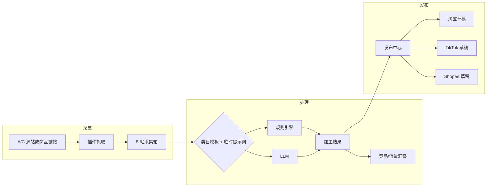

# 电商助手（大航海）— 项目规划

> **v2 功能需求**以 [REQUIREMENTS_V2.md](./REQUIREMENTS_V2.md) 为准；本文保留 v0.1 里程碑与会议背景。  
> 技术底座：`frontend-stack-reference-pack`（React 19 + Vite 6 + Tailwind v4 + shadcn + React Query + Zustand）  
> UI 参考：https://psa-b6i.pages.dev/  
> 版本：v0.1 规划稿 · 2026-05-29

---

## 1. 产品定位

**B 站（工作台）** 是运营中枢：登录后管理采集商品、执行规则/LLM 处理、查看选品洞察、触发发布到各平台草稿箱。

**浏览器插件** 是数据采集与回写通道：在 A/C 源站（1688、拼多多、Amazon 等）或链接解析场景下抓取可见数据，写入 B 站；可选携带用户 Cookie 或在已登录后台页面写入淘宝 / TikTok / Shopee 等草稿箱。

---

## 2. 核心用户旅程

---

## 3. 功能模块（与会议结论对齐）

### 3.1 采集层（插件 + API）

| 能力 | 说明 | 优先级 |
|------|------|--------|
| 详情页分层抓取 | 插件：L1 JSON → L2 JSON-LD → L4 DOM；见 `COLLECT_ARCHITECTURE.md` | P0 |
| 链接直采 | 粘贴 URL，B 站 parse API；复杂页走 Worker | P0 |
| 批量榜单 TOP N | Worker：Playwright + 随机延迟 250–2400ms；用户确认后执行 | P2 |
| Cookie 模式 | 用户授权后复用登录态（合规与用户确认） | P1 |
| 图片/主图/SKU | 详情页与输出图数据 | P0 |
| 写入 B 站 | `POST /api/v1/collect-jobs` 批量入库 | P0 |

### 3.2 处理层 — 信息分析与整理（B 站）

**输入**：采集箱中的原始商品 JSON（标题、属性、价格、图、来源 URL、平台标识）。

**处理管线**（可编排、可回放）：

1. **规则引擎**（确定性，优先执行）
   - 汇率/平台价：`VN = CNY × 3500 × 2.5` 等可配置公式
   - 标题截断：≤20 字（按目标平台配置）
   - 字段映射、单位换算、违禁词过滤
2. **类目模板**（累积式，非万能 Prompt）
   - 首期：**童装** 单模板跑通 → 男装/女装扩展
   - 后台按用户所选模板匹配工作流（不同 Prompt + 不同规则集）
3. **临时提示词**（用户看品后追加）
   - 仅作用于当前 SKU/批次，不入库为模板
4. **LLM**
   - 标题优化、描述改写、多语言（越南语、泰语等）
   - 风险：通用 Prompt 易「胡编」→ 必须类目模板 + 模型 A/B
5. **洞察增强**（P1/P2）
   - 同源平台 TOP100 标题关键词归纳
   - TOP10 销量竞品图/标题特征
   - **流量词替换**：从商品后台拉流量数据，替换无效词（RPA 或插件脚本）

**输出指标**（会议要求）：区分「高曝光」与「高转化」两套结果标签。

### 3.3 发布层（插件回写）

| 目标平台 | 方式 | 优先级 |
|----------|------|--------|
| 淘宝/天猫 | 后台草稿 DOM 填充 | P1 |
| TikTok Shop | 卖家中心草稿 | P1 |
| Shopee | 卖家中心草稿 | P1 |

实现策略：内容脚本 + 可选手动确认；敏感操作二次确认；失败重试与日志回传 B 站。

**BRD v1.1 对齐**：越南 Shopee（标题≤20字、×3.5、9图）与泰国 TikTok（五段SKU、×2.5、主图≥5）规则见 `docs/LISTING_PUBLISH_IMPLEMENTATION.md` 与 `docs/BUSINESS_REQUIREMENTS_TRACEABILITY.md`。

### 3.4 选品建议（B 站增值）

- 类目趋势、毛利测算、跨平台价差（依赖规则引擎数据）
- 与「采集箱」「处理工作台」同一导航，避免孤立功能

---

## 4. 系统边界

| 组件 | 职责 |
|------|------|
| **Web (customer)** | 登录、采集箱、处理工作台、模板/规则配置、发布任务、选品看板 |
| **Web (admin)** | 可选：租户、类目模板库、模型配置、审计（二期） |
| **API** | REST `/api/v1/*`，采集任务、商品、处理管线、发布任务 |
| **Worker** | 异步：LLM 调用、竞品爬取、RPA 流量抓取 |
| **Extension** | content / background / popup；与 B 站 OAuth 或 API Token 通信 |
| **LLM 网关** | 统一 Prompt 版本、模型路由、成本与日志 |

详见 `ARCHITECTURE.md`。

---

## 5. 信息架构（对齐 psa 原型）

登录后建议路由（customer）：

| 路由 | 页面 | 说明 |
|------|------|------|
| `/login` | 登录 | 与线上一致 |
| `/app` | 工作台首页 | 今日采集/待处理/发布失败 |
| `/app/inbox` | 采集箱 | 源站、状态、批量操作 |
| `/app/workbench/:id` | 处理工作台 | 左侧原文、右侧管线与预览 |
| `/app/templates` | 类目模板 | 童装等模板 CRUD |
| `/app/rules` | 规则库 | 价格公式、字数、翻译 |
| `/app/insights` | 选品洞察 | 竞品、关键词（P1） |
| `/app/publish` | 发布中心 | 任务队列、平台账号 |
| `/app/settings` | 设置 | 插件绑定、API Key、语言 |

---

## 6. 里程碑

### Phase 0 — 原型（当前）

- [x] 项目规划文档
- [ ] `web/` 可点击静态原型（主要页面线框）
- [ ] `extension/` Manifest + Popup 线框
- [ ] OpenAPI 草案

### Phase 1 — MVP（4–6 周）

- B 站：登录、采集箱 CRUD、单类目模板 + 3 条规则 + LLM 标题
- 插件：1 个源站详情页抓取 → 写入 B 站
- 无自动发布，仅导出 JSON/CSV

### Phase 2 — 闭环（+4 周）

- 童装模板稳定；临时 Prompt；越南语/泰语
- 插件发布到 1 个平台草稿（如 Shopee）
- 竞品 TOP10 关键词（单源站）

### Phase 3 — 增强

- 流量词替换、双指标输出
- 多源站、多平台发布
- Admin、团队权限、关键词库用户自定义

---

## 7. 风险与对策

| 风险 | 对策 |
|------|------|
| LLM 标题胡编 | 类目模板 + 结构化输出 JSON Schema + 人工抽检 |
| 平台反爬/封号 | 用户自有 Cookie、限速、明确合规提示 |
| 插件商店审核 | 最小权限 Manifest；敏感能力可选安装包 |
| 前后端不同步 | OpenAPI 契约 + `gen:api` |

---

## 8. 附录：会议白板要点

- 插件：技术验证完成，需真实账号测详情页与图片。
- 标题优化：飞书工作流已通，但 LLM 效果差 → 查 Prompt vs 模型。
- 策略：**放弃万能 Prompt**，先做童装模板，再扩展男女装。
- 增强：引入商品流量数据指导换词；RPA/脚本取后台数据。
- 架构：**累积类目模板** 优于抽象通用流程；服装类目优先。
