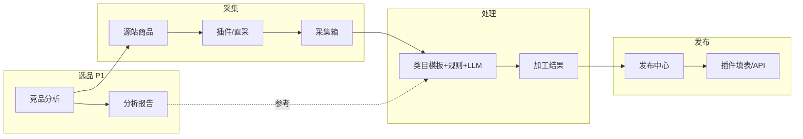

# 电商 AI 助手 — 产品需求规格书 v2.0

> **版本**：v2.0.0  
> **日期**：2026-05-30  
> **状态**：已定稿（规划基线）  
> **取代**：`docs/REQUIREMENTS_V2.md`（2026-05-30 草稿）、与 `docs/PROJECT_PLAN.md` v0.1 中冲突处以本文为准  
> **读者**：产品、研发（Scope-A 插件 / Scope-B Web+API）、测试

---

## 0. 文档说明

### 0.1 目的

本文是 **第二版（v2）唯一功能需求规格**，用于：

- 明确相对 **v1 演示版** 的增量与验收标准；
- 指导采集 → 处理 → 发布三层架构的实现与拆分；
- 与 `docs/COLLECT_SCHEMA.md`、`shared/listing/*` 及追踪表对齐。

### 0.2 关联文档（专题设计，不重复全文）

| 文档 | 用途 |
|------|------|
| [BUSINESS_FLOW_V2.md](./BUSINESS_FLOW_V2.md) | 业务流程与竞品前置 |
| [ARCHITECTURE_V2.md](./ARCHITECTURE_V2.md) | 三层架构与 UI 映射 |
| [ARCHITECTURE_ANALYSIS_V2.md](./ARCHITECTURE_ANALYSIS_V2.md) | 独立性/完备性论证（附录） |
| [CATEGORY_TEMPLATES_V2.md](./CATEGORY_TEMPLATES_V2.md) | A/B/C 品类 SKU 模式 |
| [CATEGORY_FASHION_DESIGN_V2.md](./CATEGORY_FASHION_DESIGN_V2.md) | 男装/女装/童装差异 |
| [CATEGORY_PRODUCT_DESIGN_V2.md](./CATEGORY_PRODUCT_DESIGN_V2.md) | 橱柜/吊灯/T恤差异 |
| [COLLECT_SCHEMA.md](./COLLECT_SCHEMA.md) | 采集契约（NormalizedProduct） |
| [LISTING_PUBLISH_IMPLEMENTATION.md](./LISTING_PUBLISH_IMPLEMENTATION.md) | 上架实现与 Gap |
| [SCOPE_FEATURES.md](./SCOPE_FEATURES.md) | Scope-A/B 功能清单 |
| [BEST_PRACTICES_RESEARCH.md](./BEST_PRACTICES_RESEARCH.md) | 行业调研 |
| [DEEP_RESEARCH_V2.md](./DEEP_RESEARCH_V2.md) | 行业 ERP 对标与平台规则 |
| [requirements-tracker/](./requirements-tracker/) | 字段/UI 核对（随实现更新） |
| [TITLE_OPTIMIZATION_REQUIREMENTS.md](./TITLE_OPTIMIZATION_REQUIREMENTS.md) | 天猫标题优化7步流程（采集→生成→对比→更换） |

### 0.3 术语

| 术语 | 含义 |
|------|------|
| **B 站** | Web 工作台 + API（`web/`、`api/`） |
| **源平台** | 国内供货/竞品来源：淘宝、天猫、拼多多、1688、抖音等 |
| **目标平台** | 东南亚卖家后台：越南 Shopee、泰国 TikTok Shop、菲律宾 Shopee 等 |
| **Raw / 原始商品** | 采集入库快照，对应 `NormalizedProduct` + 库内 `products` |
| **Processed / 加工商品** | 规则 + LLM + 模板后的上架载荷 |
| **管线（Pipeline）** | 规则引擎 → 类目模板 → 可选 LLM → 校验 → 输出 |
| **五段 SKU** | `{PREFIX}-{SEQ}-{SIDE}-{COLOR}-{SIZE}`，见 §5.3 |

---

## 1. 产品定位与目标

### 1.1 定位

**B 站** 是跨境运营中枢：登录后管理采集商品、按类目模板与规则执行处理管线、查看选品洞察、创建并跟踪发布任务。

**浏览器插件** 是采集与回写通道：在源站详情页抓取数据写入 B 站；在目标卖家中心将加工结果填入表单（或对接 Open API）。

### 1.2 商业目标

| 指标 | 现状（传统 ERP / 手工） | v2 目标 |
|------|----------------------|---------|
| 单商品上品耗时 | 约 30–60 分钟 | **≤ 5 分钟**（含人工确认） |
| 选品依据 | 经验为主 | **竞品分析 + 模板规则** |
| SKU / 价格 / 标题 | 大量手工 | **规则确定性 + AI 辅助** |
| 多市场 | 规则分散 | **按市场配置倍率与字段** |

### 1.3 范围（In Scope / Out of Scope）

**In Scope（v2）**

- 源平台采集（插件为主、链接直采为辅）；
- 竞品与选品洞察（P1 起完整，P0 可手工导入关键词）；
- 处理管线：标题、SKU、价格、违禁、图片任务编排；
- 目标平台：越南 Shopee、泰国 TikTok Shop、菲律宾 Shopee（**P0 至少 1 站真填表**）；
- 类目模板：A 类服装优先，B/C 类按路线图扩展。

**Out of Scope（v2 不做或仅预留）**

- 完整 ERP（订单、仓储、财务）；
- 淘宝/天猫作为 **目标** 发布（v1 规划提及，v2 聚焦东南亚）；
- 插件商店公开发布与多租户 SaaS 计费（Phase 3+）；
- 保证绕过平台反爬/零封号（仅提供限速、合规提示与用户自有 Cookie）。

---

## 2. 用户与核心场景

### 2.1 角色

| 角色 | 诉求 |
|------|------|
| **运营** | 批量搬品、改标题图价、发布到多站 |
| **选品** | 看竞品标题/价格/款式趋势再决定采哪几款 |
| **管理员**（后期） | 模板库、违禁词库、模型与账号配置 |

### 2.2 核心用户旅程（v2）



**场景矩阵**

| ID | 场景 | 路径 |
|----|------|------|
| S1 | 淘宝看到爆款，搬去越南 Shopee | 采集 → 处理 → 写入 VN |
| S2 | 先分析同类标题再选品 | 竞品分析 → 采集 → 处理 → 写入 |
| S3 | 同一商品发越南 + 泰国 | 采集 → 处理 × locale → 写入 ×2 |
| S4 | 只采集备份，暂不上架 | 采集 → 结束 |
| S5 | 仅测试新模板 Prompt | 导入样例 → 处理(测试) → 结束 |
| S6 | 人工整理好 Excel，只填表 | 导入 Processed → 写入 |

---

## 3. v1 演示版基线与 v2 增量

### 3.1 v1 已交付（演示 v1 / `main` 约 2026-05-30）

以下能力 **已有 UI 或脚手架**，v2 以 **加固 + 去 Mock** 为主：

| 能力 | v1 状态 | 代码/文档锚点 |
|------|---------|----------------|
| 登录与导航 | ✅ | `web/` 路由 |
| 采集箱列表与筛选 | ✅ 服务端筛选 | `GET /products` query |
| 工作台编辑 | ✅ 标题/短描述/SKU/图片按钮 | `WorkbenchPage` |
| 类目模板 CRUD + SKU 配置 UI | ✅ | `TemplatesPage`、`sku_config_json` |
| 五段 SKU 纯函数 | ✅ | `shared/listing/skuEncoder.ts` |
| 市场定价/标题/图片/违禁规则 | ✅ 库内 | `shared/listing/*` |
| 插件分层采集 | ✅ 1688/淘宝等 | `extension/content/` |
| 插件填表 | ⚠️ **Mock 预览面板** | `publish-fill.js` |
| LLM / 图片处理 | ⚠️ **Mock** | Pipeline Worker 占位 |
| 选品洞察 GMV/CTR | ⚠️ **Mock 数据** | `insights` 页 |
| API | ✅ Hono + SQLite | `api/` |

### 3.2 v2 必须新增或升级

| 能力 | v2 要求 |
|------|---------|
| **真实处理管线** | Worker 调用 LLM；结构化 JSON 输出 + Schema 校验 |
| **真实图片任务** | 队列：OCR / 翻译覆盖 / 消除笔（可分期：先 1 种） |
| **竞品分析** | Job + 持久化 Insights，工作台可引用 |
| **插件真填表** | 至少 1 个目标站 DOM 稳定写入（非仅 Mock） |
| **采集扩展** | 拼多多详情；链接直采 Worker |
| **发布状态机** | `draft → pending → filling → completed/failed` 全链路 API+UI |
| **品类工厂** | A/B/C 模板驱动 SKU 生成与 Prompt（§5） |
| **规则库可配置** | 倍率、违禁词、字数在 `/app/rules` 持久化生效 |

---

## 4. 系统架构需求

### 4.1 逻辑分层

系统划分为 **采集层、处理层、写入层**，经 **数据总线**（统一 ID 与契约）串联。详见 [ARCHITECTURE_V2.md](./ARCHITECTURE_V2.md)。

```
用户界面（采集箱 | 工作台 | 竞品洞察 | 模板 | 规则 | 发布）
        ↓
数据总线（productId、locale、templateId、状态机）
        ↓
采集层 ──→ 处理层 ──→ 写入层
```

各层 **可独立运行**（仅采集、仅分析、仅填表），但 P0 必须打通 **S1 完整路径**。

### 4.2 组件职责

| 组件 | 技术栈（与仓库一致） | 职责 |
|------|----------------------|------|
| **Web** | React 19、Vite、Tailwind v4、React Query | 全部 customer 页面 |
| **API** | **Hono**、SQLite、`/api/v1/*` | 商品、采集任务、管线、发布、模板 |
| **Shared** | TypeScript 纯函数 | SKU、定价、标题、图片、违禁、模板 |
| **Extension** | MV3 | 采集 content、填表 content、Popup |
| **Worker** | Node 异步任务 | LLM、Playwright 采集/竞品、图片 |

> **说明**：需求不再使用 Express；以当前 `api/` 实现为准。

### 4.3 数据契约（摘要）

**采集输出** 必须符合 [COLLECT_SCHEMA.md](./COLLECT_SCHEMA.md)（`NormalizedProduct`，契约版本随变更 bump）。

**处理输出**（ProcessedProduct，逻辑模型）：

| 字段 | 类型 | 说明 |
|------|------|------|
| `id` | string | 加工记录 ID |
| `sourceProductId` | string | 关联原始商品 |
| `targetLocale` | enum | `vi-VN` \| `th-TH` \| `fil-PH` \| `id-ID` |
| `templateId` | string | 类目模板 |
| `title` | string | 优化后标题 |
| `shortDescription` | string | 越南站短描述（≤20 字，见平台规则） |
| `description` | string | 详情 |
| `price` / `currency` | number / enum | 目标币别价格 |
| `skus` | ProcessedSku[] | 含 `skuCode`、库存、重量 |
| `images` | ProcessedImage[] | 含处理状态 |
| `warnings` | string[] | 违禁/规则告警 |
| `insightsRef` | string? | 关联竞品报告 ID |
| `processedAt` | ISO8601 | 处理时间 |

**竞品输出**（CompetitorInsights，P1）：

| 字段 | 说明 |
|------|------|
| `keywords` | TOP 标题词频 |
| `priceRange` | 建议价格带（CNY 或目标币） |
| `popularColors` / `sizes` | 款式趋势 |
| `sampleTitles` | 样例标题列表 |
| `generatedAt` | 报告时间 |

契约详细 TypeScript 定义在实现阶段写入 `shared/listing/types.ts`（或 OpenAPI），并与 DB migration 同步。

---

## 5. 功能需求

### 5.1 采集模块

#### FR-C-01 插件详情页采集（P0）

- **源平台**：1688、淘宝/天猫（P0）；拼多多（P1）；抖音（P2）。
- **策略**：L1 内嵌 JSON → L2 JSON-LD → L4 DOM；记录 `extractLayer` / `extractMethod`。
- **防封**：单次操作随机延迟 250–2400 ms；可配置；用户确认后使用 Cookie 模式（P1）。
- **输出**：`POST /api/v1/collect-jobs` 批量入库，payload 符合 NormalizedProduct。

#### FR-C-02 链接直采（P1）

- 用户粘贴 URL；API 创建 Job；Worker（Playwright）解析复杂页。
- 失败时返回可读错误（超时、反爬、页面无商品）。

#### FR-C-03 榜单批量采集（P2）

- 按类目/关键词抓取 TOP N；执行前用户确认；队列限流。

#### FR-C-04 采集箱（P0）

- 列表、分页、筛选：`source`、`keyword`、`dateFrom`、`dateTo`、处理状态。
- 批量：删除、标记待处理、导出 JSON/CSV（P1）。

**验收**：从 1688 与淘宝各采 1 条，采集箱字段与契约一致。

---

### 5.2 竞品与选品洞察

#### FR-I-01 竞品分析任务（P1）

- **输入**：关键词 + 源平台 + 可选类目；或基于已采集商品 ID 扩展同类。
- **处理**：Worker 抓取列表页/销量公开字段（合规范围内）；统计标题词、价格分位、颜色尺码分布。
- **输出**：`CompetitorInsights` 持久化；Insights 页展示；工作台创建处理任务时可 **挂载报告**。

#### FR-I-02 选品看板（P1）

- 展示 GMV/CTR **真实数据**（替换 Mock）；支持筛选入库。
- 与采集箱联动：「一键加入采集箱」来自洞察结果（P2）。

#### FR-I-03 竞品前置流程（P1）

- 业务流程默认推荐：**先分析 → 再采集**（见 [BUSINESS_FLOW_V2.md](./BUSINESS_FLOW_V2.md)）。
- P0 允许跳过：工作台支持用户手工粘贴 TOP 关键词作为临时 Prompt 上下文。

---

### 5.3 处理模块

#### FR-P-01 处理工作台（P0）

**布局**

- 左：原始标题、描述、图、SKU、来源链接。
- 右：目标平台/语言、类目模板、临时 Prompt、运行管线、双指标预览（高曝光 / 高转化）、手动编辑、保存、发起发布。

**编辑**

- 标题字数实时统计（按目标平台规则）；
- SKU 表：增删改、`skuCode` 可自动生成；
- 图片：标记主图、触发消除笔/翻译任务（见 FR-P-04）；
- 保存：`PATCH /products/:id` 写回加工字段。

#### FR-P-02 处理管线（P0 骨架，P0.5 真实 LLM）

执行顺序（可配置跳过）：

1. **规则引擎**（必须）：定价、字数截断、单位、违禁词、面料一致性检查。
2. **类目模板**：加载 `systemPrompt` + `skuConfig` + 平台规则集。
3. **临时 Prompt**：仅当前商品生效，不写入模板库。
4. **LLM**（v2 必须真实调用）：结构化输出；失败降级为规则-only 并 `warnings`。
5. **校验**：`antiBan.scan`、SKU 完整性、图片数量。

**输出**：写入 `processed` 字段；保留历史运行记录（P1）。

#### FR-P-03 SKU 编码（P0）

**标准：五段式**（全项目 v2 统一，取代需求追踪中「六段」草案）

```
{PREFIX}-{SEQUENCE:4}-{SIDE}-{COLOR}-{SIZE}
```

| 段 | 说明 | 示例 |
|----|------|------|
| PREFIX | 店铺前缀，模板可配置 | BF |
| SEQUENCE | 0001–9998 递增 | 0001 |
| SIDE | P / R / PR | PR |
| COLOR | WH, BK, RD… | WH |
| SIZE | S, M, L, XL… | S |

**白色钩子**（单款占位）：

- 编码：`{PREFIX}-9999-P-WH-{SIZE}`
- 默认：价格 400（目标币或规则换算）、库存 5、重量 220g

**印花后缀 +B/+H**：记入 **ADR-001**（附录 B），v2.0 **不实现**；若业务强制需要，在 v2.1 扩展为可选第 6 段或属性字段，不破坏五段主键。

实现：`shared/listing/skuEncoder.ts`；UI 与 API 禁止出现第二套编码规则。

#### FR-P-04 价格计算（P0）

| 市场 | 平台 | 公式（默认可配置） | 默认库存 | 默认重量 |
|------|------|-------------------|----------|----------|
| 越南 | Shopee | 原价 CNY × **3.5** → VND 换算 | 50 | 220g |
| 泰国 | TikTok | 原价 × **2.5** → THB | 50 | 220g |
| 菲律宾 | Shopee | **固定低价策略**（如 299/399/499 PHP，规则库配置） | 800 | 220g |
| 印尼 | Shopee | 原价 × 3.5 | 50 | 220g（**写入 P2**） |

汇率与取整策略在 `shared/listing/marketPricing.ts` 单点维护。

#### FR-P-05 标题与翻译（P0）

| 市场 | 规则 |
|------|------|
| 越南 Shopee | 标题 ≤ **20 字符**（Unicode 码点计数）；语义压缩后翻译越南语；剔除国内标识 |
| 泰国 TikTok | 标题 ≤ 220 字符；年轻化、可参考竞品；泰语翻译 |
| 菲律宾 Shopee | ≤ 120 字符；英语/菲律宾语混合策略可配置 |

**短描述**：越南站 20 字内独立字段 `shortDescription`。

#### FR-P-06 违禁与合规（P0）

- **品牌词库**：Nike、Adidas、Disney、LV、Gucci、Chanel、爱马仕、苹果、三星、华为、NASA 等（可扩展）。
- **国内标识**：3C、产地、包邮承诺等按平台剔除。
- **面料**：标题/属性 Cotton 与 Polyester 不得矛盾。
- 扫描结果进入 `warnings`；发布前 **阻断**（可配置为仅警告）。

#### FR-P-07 图片处理（P1）

| 市场 | 数量/规格 | 处理 |
|------|-----------|------|
| 越南 Shopee | 9 张，1:1 800×800 | 消除笔 + 中→越 |
| 泰国 TikTok | 主图 ≥5，详情 4 槽 | 消除笔 + 中→泰 |

消除对象：质保/退货/包邮文案、LOGO、水印、价签、厂家资质图等。

任务模型：`pending → running → done/failed`；API `POST /image-tasks`（与现网对齐扩展）。

---

### 5.4 品类模板（A / B / C）

模板是 **累积式** 配置：系统 Prompt + 规则集 + SKU 模式 + 可选任务 Prompt。详见 [CATEGORY_TEMPLATES_V2.md](./CATEGORY_TEMPLATES_V2.md)。

| 模式 | 类型 | SKU 规模 | 代表 | v2 优先级 |
|------|------|----------|------|-----------|
| **A** | 多规格服装 | 15–60 | T恤、童装、裤装 | **P0** |
| **B** | 中规格产品 | 3–27 | 吊灯、小家电 | P1 |
| **C** | 少规格/定制 | 1–5 + 定制项 | 橱柜 | P2 |

**FR-T-01** 模板 CRUD：名称、关联 `category_id`、平台、`sku_config_json`、`system_prompt`、启用状态。

**FR-T-02** 服装子类（男装/女装/童装）：尺码表、颜色集、标题风格（emoji 策略）差异见专题文档。

**FR-T-03** 工厂接口（实现要求）：

```typescript
interface CategoryTemplateDriver {
  mode: 'A' | 'B' | 'C';
  buildSkus(input: NormalizedProduct, config: SkuConfig): ProcessedSku[];
  buildSystemPrompt(locale: TargetLocale, platform: TargetPlatform): string;
  validate(processed: ProcessedProduct): string[];
}
```

**FR-T-04** 模板页须展示 SKU 编码说明（悬停 Tips），与 `web/src/lib/skuEncodingHints.ts` 一致。

---

### 5.5 发布模块

#### FR-U-01 发布任务（P0）

- 从工作台或采集箱创建；绑定 `productId`、`targetLocale`、账号（P1）。
- 状态机：

```text
draft → pending → filling → completed | failed
```

| 状态 | 含义 |
|------|------|
| draft | 草稿，未确认 |
| pending | 用户确认，待插件领取 |
| filling | 填表进行中 |
| completed | 成功 |
| failed | 失败，可重试，附 `lastError` |

#### FR-U-02 插件填表（P0 真写 / P1 多站）

- **P0**：越南 Shopee 卖家中心 **真实 DOM 写入**（标题、价格、SKU 表、图片 URL 字段级）。
- **P1**：泰国 TikTok、菲律宾 Shopee。
- 保留 **手动确认** 模式；敏感步骤二次确认。
- 失败：重试 3 次、回传日志；可选保留 Mock 预览作 **调试开关**（默认关）。

#### FR-U-03 发布中心 UI（P0）

- 队列列表、状态筛选、重试、跳转工作台。

#### FR-U-04 Open API 发布（P3）

- Shopee / TikTok Open Platform 对接作为写入层第二实现，与 DOM 填表抽象同一 `PublishingAdapter`。

---

### 5.6 标题优化（天猫 V.0530）

> 详见 [TITLE_OPTIMIZATION_REQUIREMENTS.md](./TITLE_OPTIMIZATION_REQUIREMENTS.md)；以下为 v2.0 集成要点。

#### FR-TO-01 搜索词采集（P1）

- 模拟登录天猫"生意参谋" → 市场 → 搜索排行 → 指定类目 → 7天数据。
- 输出：搜索词 + 统计值，持久化供标题生成使用。
- 技术：Playwright Worker；失败可降级为手工导入 CSV。

#### FR-TO-02 标题生成（P0）

- 输入：搜索词排行 + 系统 Prompt（类目风格）+ 商品原始信息。
- LLM 生成优化标题，输出结构化 JSON（含评分预估）。
- 与 §5.3 FR-P-05 标题规则联动：越南 ≤20 字、泰国 ≤220 字。

#### FR-TO-03 标题对比分析（P0）

- 对比原始标题 vs 建议标题，给出：
  - 删除词 / 加入词
  - 人气分预估
  - 改进建议列表
- UI：双栏对比展示（原始 | 建议），支持人工微调。

#### FR-TO-04 标题更换（P0）

- 确认对话框（步骤六）→ 用户授权后执行。
- 操作路径：天猫商家后台 → 商品 → 填写商品ID → 悬停编辑 → 提交。
- 技术：Playwright Worker；选择器映射表独立维护。
- 验证：每次修改后截图 + 文本读取确认成功。

#### FR-TO-05 页面结构探索与试错（P2）

- 自动探索：chrome-devtools 观察页面结构，定位编辑入口。
- 试错学习：失败时调整选择器、触发事件、编辑模式入口。
- 沉淀复盘：生成"精准操作指令"供后续复用。

---

### 5.7 规则库与设置

#### FR-R-01 规则库（P1）

- 价格倍率、库存默认值、标题字数、违禁词增删、面料规则。
- 修改后对新管线任务生效；支持版本号（审计 P2）。

#### FR-S-01 设置（P0）

- API Token / 插件配对；
- LLM Provider 与模型选择（已有设置页须避免无限渲染回归）；
- 默认目标市场、默认模板。

---

## 6. 平台规则矩阵（验收依据）

规则以 [DEEP_RESEARCH_V2.md](./DEEP_RESEARCH_V2.md) 为参考，冲突时以平台最新政策为准并更新规则库。

| 项 | 越南 Shopee | 泰国 TikTok | 菲律宾 Shopee |
|----|-------------|-------------|---------------|
| 标题 | ≤20 字符 | ≤220，可 emoji | ≤120，偏英语 |
| 主图 | 9 张，1:1 | ≥5 张 | 9 张 |
| 价格 | ×3.5 | ×2.5 | 低价固定档 |
| SKU | 五段 | 五段 | 五段或平台原生 |
| 品牌 | 无品牌/授权 | 无品牌为主 | 同左 |

**越南 13 步编品流程**：业务培训材料中的步骤清单在 [requirements-tracker](./requirements-tracker/) 单独追踪；v2.0 要求工作台 **覆盖其中 P0 字段**（标题、价、库存、SKU、主图），其余步骤（物流模板、包裹尺寸等）列入 **P1 清单**，见附录 A。

---

## 7. 信息架构（页面）

| 路由 | 页面 | 优先级 | 说明 |
|------|------|--------|------|
| `/login` | 登录 | P0 | JWT |
| `/app` | 首页 | P0 | 今日采集/待处理/失败数 |
| `/app/inbox` | 采集箱 | P0 | 筛选、批量 |
| `/app/workbench/:id` | 工作台 | P0 | 管线 + 编辑 |
| `/app/templates` | 类目模板 | P0 | CRUD + SKU 配置 |
| `/app/rules` | 规则库 | P1 | 倍率、违禁 |
| `/app/insights` | 选品洞察 | P1 | 竞品、GMV/CTR |
| `/app/publish` | 发布中心 | P0 | 任务队列 |
| `/app/settings` | 设置 | P0 | 插件、LLM |

前端分层遵循 `frontend-stack-reference-pack`：**Route → View → Panel**；服务端状态用 React Query。

---

## 8. 非功能需求

### 8.1 性能

| 指标 | 目标 |
|------|------|
| 单商品处理（含 LLM） | ≤ 5 分钟 P95 |
| 批量 10 商品 | ≤ 30 分钟（队列） |
| 页面首屏 | ≤ 2 s（本地 dev 除外） |

### 8.2 安全与合规

- 凭证仅存用户环境或加密字段；禁止提交 `.env` 至仓库；
- 采集/填表须展示合规提示；用户对自己的账号与 Cookie 负责；
- 发布与删除须鉴权（JWT）。

### 8.3 可维护性

- 采集契约变更：同步 Schema、插件、`collectTypes.ts`；
- 平台 DOM 变更：selector 映射表独立文件（`selectors-*.js`）；
- 关键纯函数单元测试：`api` 内已有测试基线，新增规则须补测。

### 8.4 可观测性（P1）

- 管线运行 ID、LLM token 用量日志；
- 发布失败 `lastError` 与插件回传 stack（脱敏）。

---

## 9. 开发优先级与里程碑

### 9.1 优先级定义

| 级别 | 含义 |
|------|------|
| **P0** | 不交付则 v2.0 不算闭环 |
| **P1** | v2.1，核心竞争力（竞品、真图片、多站填表） |
| **P2** | v2.2+，效率与品类扩展 |

### 9.2 路线图

| 里程碑 | 目标 | 主要交付 |
|--------|------|----------|
| **v2.0** | 真闭环 | 真实 LLM 管线；VN Shopee 真填表；采集箱+工作台+发布状态机；A 类模板；违禁+定价+五段 SKU |
| **v2.1** | 选品与多站 | 竞品 Job；Insights 真实数据；TH TikTok + PH Shopee 填表；规则库；图片任务 MVP |
| **v2.2** | 品类与效率 | B 类吊灯模板；链接直采；批量榜单；拼多多采集 |
| **v2.3** | 扩展 | C 类定制；印尼站；Open API 适配器；团队多用户 |

### 9.3 Scope 分工（不变）

| Scope | 目录 | v2 重点 |
|-------|------|---------|
| **Scope-A** | `extension/` | 采集稳定性、真填表、Popup 三栏 |
| **Scope-B** | `web/`、`api/` | 管线、模板、发布、洞察 |
| **Contract** | `COLLECT_SCHEMA`、`shared/` | 契约与规则单点 |

---

## 10. 验收标准

### 10.1 功能验收（v2.0 发布门槛）

- [ ] 插件从 **1688 + 淘宝** 各采集 1 条，采集箱字段与 `COLLECT_SCHEMA` 一致
- [ ] 工作台选择 **越南 + 服装模板**，运行管线得到 **非 Mock** 的标题/SKU/价格
- [ ] 五段 SKU 自动生成，白色钩子符合 §5.3
- [ ] 越南标题 ≤20 字校验生效；违禁词命中进入 `warnings` 且可阻断发布
- [ ] **越南 Shopee** 插件填表成功，`publish` 状态 `completed`（非仅 Mock 面板）
- [ ] 发布失败可重试，状态为 `failed` 且带错误信息
- [ ] `api` 单元测试通过；`web` 生产构建通过

### 10.2 功能验收（v2.1 增量）

- [ ] 竞品分析 Job 产出报告并在工作台可引用
- [ ] 泰国或菲律宾至少 1 站填表成功
- [ ] 图片任务可创建并完成至少 1 种处理（消除或翻译）
- [ ] Insights 页展示真实或 Worker 拉取数据（非静态 Mock）

### 10.3 质量验收

- [ ] 随机抽检 10 条：无未授权品牌词、无国内发货标识残留（按规则库）
- [ ] 主图无价格标签/水印（图片任务或人工标记为已处理）

---

## 11. 开放问题与决策记录

| ID | 问题 | 决策 | 日期 |
|----|------|------|------|
| ADR-001 | SKU 五段 vs 六段（+B/+H） | **v2.0 采用五段**；印花后缀延后 v2.1 或走属性字段 | 2026-05-30 |
| ADR-002 | 目标平台范围 | v2.0 以 **VN Shopee** 为 P0 真填表；TH/PH 为 P1 | 2026-05-30 |
| ADR-003 | 菲律宾定价 | 规则库可配置固定档，非单一「500 PHP」写死 | 2026-05-30 |
| ADR-004 | API 框架 | **Hono**，文档不得再写 Express | 2026-05-30 |
| OPEN-001 | 越南 13 步与 UI 逐步映射 | 附录 A 清单评审后拆 P1 任务 | 待定 |

---

## 附录 A：越南 Shopee 编品步骤（追踪用）

> 完整 13 步以运营培训材料为准；实现状态在 `requirements-tracker/` 维护。

| 步骤 | 内容 | v2.0 | v2.1 |
|------|------|------|------|
| 1–3 | 类目、基础信息 | 模板+工作台 | — |
| 4–6 | 标题、短描述、属性 | 管线+校验 | — |
| 7–9 | SKU、价格、库存 | 五段+钩子 | — |
| 10–11 | 图片、详情图 | 列表+任务 | 真处理 |
| 12–13 | 物流、包裹尺寸 | — | 规则库+填表 |

---

## 附录 B：ADR-001 印花后缀（延后）

调研材料中的 **+B / +H** 印花后缀不纳入 v2.0 五段主码；若上线，优先方案：

1. `attributes.printSide` = `B` | `H` | `BH`；或  
2. 扩展 `SEQUENCE` 子命名空间（需平台确认是否接受更长 SKU）。

---

## 附录 C：需求追溯

| 需求 ID 前缀 | 模块 |
|--------------|------|
| FR-C-* | 采集 |
| FR-I-* | 洞察/竞品 |
| FR-P-* | 处理 |
| FR-TO-* | 标题优化（天猫） |
| FR-T-* | 模板 |
| FR-U-* | 发布 |
| FR-R-* / FR-S-* | 规则/设置 |

实现状态请同步更新 [requirements-tracker/FIELD_CHECKLIST.md](./requirements-tracker/FIELD_CHECKLIST.md) 与 [INTERFACE_CHECKLIST.md](./requirements-tracker/INTERFACE_CHECKLIST.md)。

---

*文档结束 — 电商 AI 助手 PRD v2.0.0*
