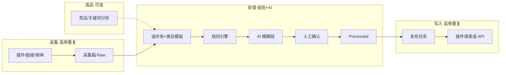

# 电商 AI 助手 — 产品需求规格书 v2.0（重基线）

> **版本**：v2.0-rebase  
> **日期**：2026-05-30  
> **状态**：规划基线（待运营确认 ADR）  
> **依据**：[`SOURCES_V2_0.md`](./SOURCES_V2_0.md) + [`RESEARCH_V2_ORIGIN.md`](./RESEARCH_V2_ORIGIN.md)  
> **取代**：此前基于演示版推导的 `REQUIREMENTS_V2.md` 优先级与范围（该文档仅作历史参考）

---

## 0. 产品一句话

**用「规则引擎 + 类目模板 + AI 判断」替代 ERP 上品环节中的重复手工编辑**，服务东南亚 Shopee / TikTok Shop 小微卖家；不是完整 ERP。

---

## 1. 真实需求：三棱镜评估

所有功能必须回答：**是否高频？是否重复劳动？是否模糊规则（需 AI 判断）？**

### 1.1 三棱镜定义

| 维度 | 含义 | 系统应对 |
|------|------|----------|
| **高频** | 每款必做、每天多款 | 必须进主流程 UI，默认自动化 |
| **重复** | 规则固定、可批量 | 模板 + 批处理 + 插件/API，**不用 LLM** |
| **模糊** | 需语境、竞品、审美、合规边界 | **LLM + RAG + 人工确认** |

### 1.2 从原始资料拆出的「真实需求」

#### A. 高频 + 重复 + 规则清晰 → **规则引擎，非 AI**

| 需求 | 原始出处 | 频率 | 处理方 |
|------|----------|------|--------|
| 采集商品链接/图/SKU | BRD §二、§五 | 每款 | 插件/Worker |
| 越南售价 ×3.5、库存 50 | BRD §3.3、§七 | 每 SKU | `marketPricing` |
| 泰国售价 ×2.5 | BRD §4、§七 | 每 SKU | 同上 |
| 菲律宾固定低价档 | tracker/PPT | 每款 | 规则库可配置 |
| 六段 SKU（+B/+H 印花） | 谷歌报告1、课堂笔记 | 每变体 | `skuEncoder` + 模板 |
| 白色钩子 9999/400/5/220g | BRD §4.4 | 单款时 | 模板开关 |
| 图片 9 张、1:1 800 | BRD §3.4 | 每款 | 图片流水线 |
| 消除质保/包邮/LOGO 等 | BRD §3.4、§八 | 每图 | OCR+规则关键词 |
| 违禁品牌词/国内标识 | BRD §八 | 每款 | `antiBan` |
| 物流重量 220g、包裹 10-5-10 | tracker/PPT | 每款 | 字段+默认值 |
| 13 步越 Shopee 字段覆盖 | BRD §3.1 | 每款 | 工作台 checklist |

#### B. 高频 + 重复 + **部分模糊** → **AI 辅助 + 人审**

| 需求 | 为何模糊 | AI 做什么 | 人做什么 |
|------|----------|-----------|----------|
| 越南标题压到极短 | 删哪些词保留哪些义 | 语义压缩 + 越语翻译 | 确认是否可读 |
| 泰 TikTok 标题 | 「参考同行」无公式 | RAG 竞品标题风格 | 选 exposure/conversion |
| 详描/简易描述改写 | 本地化语气 | 模板 Prompt + 改写 | 抽检 |
| 图片翻译排版 | OCR 块布局 | 翻译+覆盖建议 | 手动微调译图 |
| 面料 Cotton/Poly 一致 | 属性与文案交叉 | 一致性扫描 | 改属性或改文案 |
| 选哪 9 张图 | 外观/参数/场景优先级 | 类目策略分类 | 替换/删图 |

#### C. 中频 + 战略价值 → **选品/竞品（P1，但架构预留）**

| 需求 | 来源 | 说明 |
|------|------|------|
| 源站 TOP 标题词/价格带 | PROJECT_PLAN 会议、网络调研 | 处理前生成 Insights，喂 RAG |
| 同类爆款主图/色码趋势 | 同上 | 不进「清晰规则」，进模板上下文 |
| 流量词替换 | 会议白板 | P2：需 RPA/后台数据 |

#### D. **不应做进 v2.0 核心**（ERP 范畴）

订单、采购、仓储 WMS、客服、财务、多租户计费、店群矩阵防关联 — 仅界面预留或不做。

### 1.3 关键纠正：当前项目的误区

| 误区 | 正确做法 |
|------|----------|
| 把 ×3.5、五段 SKU、9 图全塞给 LLM | 规则引擎确定性输出 |
| 万能 Prompt 一条跑全品类 | **累积类目模板**（会议结论） |
| 认为「AI 管线」= 全部智能化 | 管线 = 规则 → 模板 → **可选** LLM 段 → 校验 |
| 越南标题/短描述 ≤20 字 | BRD §3.2 + 运营调研 | 列表标题与短描述均校验 | `titleRules` |

---

## 2. 流程重整：从 ERP 手工到 AI 助手

### 2.1 现网 ERP 流程（原始资料中的操作路径）

以越南 Shopee 为例（`BUSINESS_REQUIREMENTS_DEV.md` §3.1）— **店八方/同类 ERP 典型路径**：

```text
登录 ERP → 上货/采集箱 → 粘贴未发布链接
  → 编标题(≤20) → 简易描述 → 详描
  → 选类目 → SKU(价×350% 库存50) → 9图(尺寸/消除/翻译)
  → 物流 → 保存 → 一键翻译 → 发布
```

泰国 TikTok（§4.1）：后台新建 → 主图≥5 → 标题(参考同行) → 类目/无品牌 → 变体+五段 SKU → 详情图 → 发布。

**痛点本质**：步骤多、在 ERP 与卖家后台之间来回切、**重复点击**；标题/图片/合规靠人眼。

### 2.2 目标：AI 助手流程（取代 ERP 上品段）



| 原 ERP 步骤 | AI 助手对应 | 实现要点 |
|-------------|-------------|----------|
| 粘贴链接采集 | 插件/链接直采 | `NormalizedProduct` 入库 |
| 编标题/描述 | 工作台：规则校验 + AI 压缩/翻译 + 双方案 | exposure / conversion |
| 选类目 | 模板 `categoryId` + 可选 LLM 建议 | 模板绑定 Prompt |
| SKU 价库存 | 规则批量生成 | 禁止 LLM 算价 |
| 9 图处理 | 图片任务队列 | 消除/翻译/人工标记 |
| 物流 | 工作台物流区 | 默认 220g、10-5-10 |
| 一键翻译 | 管线内置 locale 段 | 非单独按钮_magic |
| 发布 | 发布中心 + 插件 | 状态机 draft→completed |

### 2.3 流程在界面上的实现（可参考现有模块划分）

| 阶段 | 路由 | 职责 |
|------|------|------|
| 选品 | `/app/competitors`、`/app/insights` | 产出 Insights，**可选** |
| 采集 | `/app/inbox`、`/app/link-collect`、`/app/batch-collect` | Raw 入库 |
| 处理 | `/app/workbench/:id` | 管线 + 编辑 + 13 步 checklist |
| 配置 | `/app/templates`、`/app/rules` | 类目模板、倍率、违禁词 |
| 写入 | `/app/publish` | 任务队列、填表 |
| 系统 | `/app/settings` | 插件、LLM、主题（v1 延续） |

---

## 3. 功能需求清单（v2.0 重基线）

### 3.1 采集层

| ID | 功能 | 三棱镜 | 优先级 |
|----|------|--------|--------|
| F-C-01 | 1688/淘宝/天猫详情插件采集 | 高频+重复 | P0 |
| F-C-02 | 拼多多/抖音采集 | 高频 | P1 |
| F-C-03 | 链接直采（Worker） | 重复 | P1 |
| F-C-04 | 榜单 TOP N 批量采 | 重复 | P2 |
| F-C-05 | 采集箱：筛选/批量/导出 | 高频 | P0 |

### 3.2 选品与竞品

| ID | 功能 | 三棱镜 | 优先级 |
|----|------|--------|--------|
| F-S-01 | 关键词/TOP 标题词统计 | 模糊+战略 | P1 |
| F-S-02 | 价格带/色码分布 | 模糊 | P1 |
| F-S-03 | Insights 挂载到工作台 Prompt | 模糊 | P1 |

### 3.3 处理层 — 规则段（无 LLM）

| ID | 功能 | 优先级 |
|----|------|--------|
| F-P-R01 | 市场定价公式 | P0 |
| F-P-R02 | 六段 SKU 批量生成（+B/+H） | P0 |
| F-P-INS01 | 源平台内找同类/类似款 | P0 | 处理层，非 B 站库检索 |
| F-P-R03 | 白色钩子 | P0 |
| F-P-R04 | 标题/描述字数校验 | P0 |
| F-P-R05 | 违禁词/品牌/国内标识 | P0 |
| F-P-R06 | 图片数量/尺寸校验 | P0 |
| F-P-R07 | 敏感图关键词扫描 | P0 |

### 3.4 处理层 — AI 段（模糊规则）

| ID | 功能 | 输入 | 输出 | 优先级 |
|----|------|------|------|--------|
| F-P-A01 | 标题语义压缩+翻译 | 原标题+locale+竞品样例 | 1–2 候选标题 | P0 |
| F-P-A02 | 双指标标题 | 同上 | exposure / conversion | P1 |
| F-P-A03 | 详描/短描述改写 | 原描+模板 Prompt | 本地化文案 | P1 |
| F-P-A04 | 图片 OCR+翻译建议 | 图片+locale | 译图任务 | P1 |
| F-P-A05 | 面料/功效一致性判断 | 标题+属性 | warnings | P1 |
| F-P-A06 | RAG：同类已上架标题检索 | 内部库+竞品库 | few-shot 进 Prompt | P2 |

**约束**：LLM 输出必须 JSON Schema；失败则仅规则段结果 + warning。

### 3.5 类目模板（固定「系统提示 + SKU 模式」）

| ID | 模式 | 品类示例 | 模板内容 | 优先级 |
|----|------|----------|----------|--------|
| F-T-A | A 矩阵 | 童装、T恤、男装、女装 | 色表、码表、正反面、钩子、标题 Prompt | P0 |
| F-T-B | B 组合 | 吊灯、小家电 | 维度笛卡尔积、规格表、安装槽 | P1 |
| F-T-C | C 定制 | 橱柜 | 定制字段、加价项、询价话术 | P2 |

每个模板包含：

1. **系统 Prompt**（品类特征 + 市场规则 + 输出 JSON）  
2. **SKU 配置**（机器可读）  
3. **任务 Prompt 槽**（临时提示词，仅当前商品）  
4. **选品研究钩子**（可选引用 Insights）

### 3.6 写入层

| ID | 功能 | 优先级 |
|----|------|--------|
| F-U-01 | 发布任务状态机 | P0 |
| F-U-02 | 越南 Shopee DOM 填表 | P0 |
| F-U-03 | 泰国 TikTok / 菲律宾 Shopee 填表 | P1 |
| F-U-04 | Open API 适配器（印尼等） | P3 |

### 3.7 延续 v1、不在 v2.0 重写的模块

| 模块 | 说明 |
|------|------|
| 登录/JWT | 保持 |
| 设置：插件下载、Token、LLM 多模型、主题 | 保持 |
| `COLLECT_SCHEMA` | 契约保持，字段随 ADR 扩展 |

---

## 4. 品类附录（调研 + 原始综合）

### 4.1 A 类 — 儿童服装 / T恤

- **SKU**：5–10 色 × 5–7 码 × P/R/PR → 15–60；单款加白色钩子  
- **高频重复**：矩阵生成、×倍率、库存  
- **模糊/AI**：越 20 字压缩；泰标题同行风格；图选 9 张；A 类面料提示（童装）  
- **选品研究**：年龄段词、主色、价格带 CNY 18–65（示例）

### 4.2 B 类 — 吊灯

- **SKU**：功率 × 色温 × 控制 → 约 9–27  
- **重复**：笛卡尔积、规格对比表  
- **AI**：安装说明生成、场景化泰语标题  
- **选品**：功率段、价格带、主图是否场景图

### 4.3 C 类 — 橱柜

- **SKU**：1–5 基础 + 宽深高定制 + 加价项  
- **重复**：价格公式 `base + f(尺寸)`  
- **AI**：定制说明、越/泰咨询话术；**不**自动生成大矩阵  
- **选品**：低 SKU 高客单，重详描与信任图

---

## 5. 非功能需求

| 项 | 目标 |
|----|------|
| 单款上品（含人审） | 设计目标 ≤5 分钟 |
| 规则段延迟 | <1s |
| AI 段 | 异步，可重试 |
| 合规 | 违禁拦截可配置为阻断发布 |
| 可维护 | selector 映射、Prompt 版本号 |

---

## 6. 里程碑（按价值，非按演示）

| 阶段 | 交付 | 验证 |
|------|------|------|
| **M0** | 规则闭环：采→规则处理→越 Shopee 填表 | 不用 LLM 也能上架 |
| **M1** | 童装/T恤 模板 + AI 标题段 + 图片任务 | 10 款人工抽检通过 |
| **M1.5** | 竞品 Insights → RAG | 标题 chrF/人工偏好优于裸翻 |
| **M2** | B 类吊灯模板 | 矩阵 SKU 正确 |
| **M3** | C 类定制 + 多站 + API | 按运营节奏 |

---

## 7. 验收标准（v2.0 重基线）

- [ ] 三棱镜：每个 P0 功能在 PRD 中标注 H/R/F（高频/重复/模糊）  
- [ ] 管线：规则段与 AI 段可独立开关；LLM 失败不阻断规则结果  
- [ ] 越南：13 步字段在工作台可编辑并进入发布载荷  
- [ ] SKU：六段（含 +B/+H）+ 白色钩子与 `skuEncoder` 一致  
- [ ] 竞品：源平台内「找类似款」列表可演示  
- [ ] 图片：9 张策略 + 消除/翻译任务可追踪  
- [ ] 竞品：至少 1 份 Insights 可挂载工作台  
- [ ] 设置页：插件与 LLM 配置仍可用  

---

## 8. ADR（已定稿）

| ID | 决策 | 依据 |
|----|------|------|
| **ADR-001** | 越南 **列表标题 + 短描述** 均 ≤20 字符（码点）；汉字建议 ≤10 | `BUSINESS_REQUIREMENTS_DEV.md` §3.2、13 步流程 |
| **ADR-002** | **六段 SKU** 为准：`PREFIX-SEQ-SIDE-COLOR-SIZE` + 可选 `+B`/`+H` | `谷歌报告1.html`、`skuEncoder.ts` |
| **ADR-003** | 菲律宾默认定价 **500 PHP**（演示可改） | 谷歌报告1 |
| **ADR-004** | 泰国标题：无 20 字硬限；**同行 RAG** 优先 | TikTok 会议笔记 |
| **ADR-005** | 「找同类」= **源平台内**检索，归属 **处理层** | [BUSINESS_FLOW_V2_0.md](./BUSINESS_FLOW_V2_0.md) |

### 仍待运营确认

| ID | 问题 |
|----|------|
| ADR-TBD-01 | Shopee 后台 SEO 长标题是否与 20 字短标题并存 |

---

## 9. 文档索引

| 文档 | 用途 |
|------|------|
| [BUSINESS_FLOW_V2_0.md](./BUSINESS_FLOW_V2_0.md) | 源/处理/写入流程 |
| [DEMO_V2_0.md](./DEMO_V2_0.md) | 验收演示步骤 |
| [DEMO_PRESENTATION_FLOWS.md](./DEMO_PRESENTATION_FLOWS.md) | 多场景讲解 / 界面全覆盖 |
| [SOURCES_V2_0.md](./SOURCES_V2_0.md) | 读了什么、缺什么 |
| [original-research/README.md](./original-research/README.md) | 本地调研目录索引 |
| [RESEARCH_V2_ORIGIN.md](./RESEARCH_V2_ORIGIN.md) | 网络调研 |
| [BUSINESS_REQUIREMENTS_DEV.md](./BUSINESS_REQUIREMENTS_DEV.md) | 原始 BRD |
| [SCOPE_FEATURES.md](./SCOPE_FEATURES.md) | 界面/Scope 划分 |

---

*PRD v2.0-rebase — 从原始需求与全新调研出发，不继承 v1 演示版优先级。*
