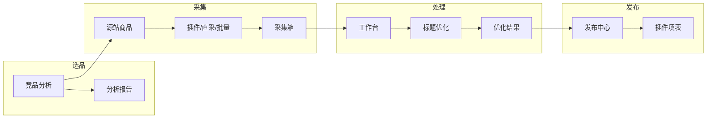

# 电商 AI 助手 — 产品需求规格书 v3.0

> **版本**：v3.0.0
> **日期**：2026-06-10
> **状态**：基线锁定（V3 代码为权威）
> **基线原则**：本文档基于 `web/src/App.tsx` 实际路由 + `web/src/pages/` 实际页面 + `web/src/lib/` 实际库反向更新；任何与代码不符的条款以代码为准。
> **取代**：`docs/REQUIREMENTS_V2.md`（保留为 v2 历史快照；v3 不再引用）
> **读者**：产品、研发（Scope-A 插件 / Scope-B Web+API）、测试

---

## 0. 文档说明

### 0.1 目的

本文是 **第三版（v3）唯一功能需求规格**，用于：

- 固化 V3 路由结构与功能模块边界；
- 反映 SPEC-A/B/C 三个轨道的实际产物；
- 与 `docs/FEATURE_STATUS_V3.md` 配合使用，标注每个 FR 的"目标 vs 实现"。

### 0.2 关联文档

| 文档 | 用途 | v3 状态 |
|------|------|---------|
| [BUSINESS_FLOW_V2.md](./BUSINESS_FLOW_V2.md) | 业务流程与竞品前置 | 沿用 v2 |
| [PIPELINE.md](./PIPELINE.md) | 自动化开发管道 | v3.0 同步更新 |
| [SPEC-A-V30-收尾优化.md](./SPEC-A-V30-收尾优化.md) | 主题清理 / 视觉回归 / 移动端 | v3.0 验收同步 |
| [SPEC-B-V31-主题系统增强.md](./SPEC-B-V31-主题系统增强.md) | 主题市场 / 预览图 / 动画 | v3.0 验收同步 |
| [SPEC-C-V40-AI标题优化器V2.md](./SPEC-C-V40-AI标题优化器V2.md) | 多平台 SEO 标题优化 | v3.0 验收同步（API 端点 v2.1 延后） |
| [FEATURE_STATUS_V3.md](./FEATURE_STATUS_V3.md) | 文档目标 vs 代码实现 对照表 | v3.0 新增 |
| [V2_VS_V3_MIGRATION.md](./V2_VS_V3_MIGRATION.md) | V2 孤儿页面 → V3 迁移映射 | v3.0 新增 |
| [AUDIT-总目标完成度.md](./AUDIT-总目标完成度.md) | 总体完成度审计 | v3.0 重写 |

### 0.3 术语

| 术语 | 含义 |
|------|------|
| **V3 路由** | `web/src/App.tsx` 中实际声明的路由；与 `web/src/v3NavGroups` 菜单一一对应 |
| **代码为基线** | 任何与本文档冲突时，以 `web/src/` 实际代码为准 |
| **V2 孤儿** | `web/src/v2/pages/` 目录下未被路由引用的页面；v3.0 已清理 |

---

## 1. 产品定位与目标

### 1.1 定位

**Web 工作台** 是跨境运营中枢：登录后管理采集商品、按类目模板与规则执行处理管线、查看选品洞察、创建并跟踪发布任务。

**浏览器插件** 是采集与回写通道：在源站详情页抓取数据写入工作台；在目标卖家中心将加工结果填入表单。

### 1.2 商业目标

| 指标 | v2 目标 | v3 实际 | 状态 |
|------|---------|--------|------|
| 单商品上品耗时 | ≤ 5 分钟 | 待 v2.1 接入 LLM 真管线 | ⏳ |
| 选品依据 | 竞品分析 + 模板规则 | 竞品页 + Insights（Mock） | ⚠️ |
| 多市场 | 按市场配置倍率与字段 | VN/TH/PH 3 站 | ✅ |
| 主题市场 | — | V3.1 主题市场（ThemeMarketplace） | ✅ |

### 1.3 范围（In Scope / Out of Scope）

**In Scope（v3.0）**

- 源平台采集（插件 + 链接直采 + 批量采集）；
- 工作台 + 标题优化（含 V2 多平台 SEO 优化器）；
- 类目模板 + 规则库；
- 发布中心（状态机 + 插件填表 + 平台集成）；
- 主题系统（V1 → V2 → V3 市场）；
- Insights（Mock 数据）；
- 团队 / 平台集成（管理面）。

**Out of Scope（v3.0 不做）**

- 真实 Worker / 后端 LLM 调用（v2.1 范围）；
- 真实竞品数据抓取（v2.1 范围）；
- Open API 对接（v2.3 范围）；
- 印尼站（v2.2 范围）。

---

## 2. 用户与核心场景

### 2.1 角色

| 角色 | 诉求 | v3 入口 |
|------|------|---------|
| **运营** | 批量搬品、改标题图价、发布到多站 | `/app/inbox` → `/app/workbench/:id` → `/app/publish` |
| **选品** | 看竞品标题/价格/款式趋势再决定采哪几款 | `/app/competitors` → `/app/insights` |
| **管理员** | 模板库、违禁词库、模型与账号配置 | `/app/templates` / `/app/rules` / `/app/settings` |
| **团队成员** | 协作、邀请、角色 | `/app/team` |

### 2.2 核心用户旅程



**场景矩阵**

| ID | 场景 | 路径 |
|----|------|------|
| S1 | 淘宝看到爆款，搬去越南 Shopee | `/app/link-collect` → `/app/inbox` → `/app/workbench/:id` → `/app/publish` |
| S2 | 先分析同类标题再选品 | `/app/competitors` → `/app/link-collect` → 处理 |
| S3 | 同一商品发越南 + 泰国 | `/app/workbench/:id` × 2 locale → `/app/publish` |
| S4 | 只采集备份，暂不上架 | `/app/link-collect` → `/app/inbox` → 结束 |
| S5 | 仅测试新模板 | `/app/templates` 导入样例 → 处理 → 结束 |
| S6 | 优化单商品标题 | `/app/workbench/:id` → 标题优化 tab → `/app/title-optimizer-v2`（V2 多平台 SEO） |
| S7 | 切换主题风格 | `/app/settings/themes` → `/app/settings/themes/market` |

---

## 3. v2 → v3 增量变更

| 能力 | v2 状态 | v3 状态 | 变更点 |
|------|---------|---------|--------|
| 标题优化（单商品 7 步流程） | 未规划 | ✅ V1 + V2 双页 | 拆为 `pages/workbench/TitleOptimizationPage.tsx`（V1 七步）与 `pages/TitleOptimizerV2.tsx`（V2 多平台 SEO） |
| 竞品分析 | 未规划 | ✅ 新增 `/app/competitors` | 即输即得分析页 |
| 链接直采 | 未规划 | ✅ 新增 `/app/link-collect` | 对应 FR-C-02 |
| 批量采集 | 未规划 | ✅ 新增 `/app/batch-collect` | 对应 FR-C-03 |
| 平台集成 | 未规划 | ✅ 新增 `/app/integrations` | 4 平台连接管理 |
| 团队 | 未规划 | ✅ 新增 `/app/team` | 成员邀请 + 角色管理 |
| 主题市场 | V2 主题页 | ✅ 升级为 `/app/settings/themes/market` | 4 内置主题 + 用户主题 + 导入导出 + 动画 |
| 工作台 | `/app/workbench/:id` 未挂载 | ✅ 挂载 V2 完整工作台（5 段 SKU + 9 图 + 13 步） | 阶段 2 迁移 |
| 采集箱路由 | 指向 `pages/inbox/InboxPage.tsx`（mock 弱版） | ✅ 改指 `pages/InboxPage.tsx`（完整 API） | 阶段 2 路由修复 |

---

## 4. 系统架构需求

### 4.1 逻辑分层

```
用户界面（采集箱 | 工作台 | 竞品洞察 | 模板 | 规则 | 发布 | 团队 | 集成 | 主题）
        ↓
数据总线（productId、locale、templateId、状态机）
        ↓
采集层 ──→ 处理层 ──→ 写入层
```

### 4.2 组件职责

| 组件 | 技术栈 | 职责 |
|------|--------|------|
| **Web** | React 19、Vite、Tailwind v4、React Query | 全部 customer 页面 |
| **API** | Hono、SQLite、`/api/v1/*` | 商品、采集任务、管线、发布、模板 |
| **Shared** | TypeScript 纯函数 | SKU、定价、标题、图片、违禁、模板 |
| **Extension** | MV3 (v3.1.0) | 采集 content、填表 content、Popup |
| **Worker** | Node 异步任务 | LLM、Playwright 采集/竞品、图片（**v3.0 占位**） |

### 4.3 数据契约

**采集输出**：`NormalizedProduct`（`docs/COLLECT_SCHEMA.md` 沿用）

**处理输出**（`ProcessedProduct`，逻辑模型）：

| 字段 | 类型 | v3 实现位置 |
|------|------|------------|
| `id` | string | `lib/collectTypes.ts` |
| `sourceProductId` | string | 同上 |
| `targetLocale` | enum | `vi-VN` / `th-TH` / `fil-PH` / `id-ID` |
| `templateId` | string | `lib/collectTypes.ts` |
| `title` / `shortDescription` / `description` | string | `lib/listingTitle.ts` + `pages/workbench/TitleOptimizationPage.tsx` |
| `price` / `currency` | number / enum | `shared/listing/marketPricing.ts` |
| `skus` | ProcessedSku[] | `shared/listing/skuEncoder.ts` |
| `images` | ProcessedImage[] | `components/workbench/ImageProcessingPanel.tsx` |
| `warnings` | string[] | `lib/bannedTerms.ts` + 平台规则 |

---

## 5. 功能需求（按路由分块）

> **状态标签说明**：✅ 已实现 | ⚠️ Mock/部分实现 | ❌ 未实现 | ⏳ v2.1+

### 5.1 采集模块

| FR | 描述 | 路由 | 状态 | 证据 |
|----|------|------|------|------|
| FR-C-01 | 插件详情页采集 | extension/content/content-script.js | ✅ | 1688/淘宝/天猫/拼多多/抖音 |
| FR-C-02 | 链接直采 | `/app/link-collect` | ⚠️ UI Mock | `pages/link-collect/LinkCollectPage.tsx` |
| FR-C-03 | 榜单批量采集 | `/app/batch-collect` | ⚠️ UI Mock | `pages/BatchCollectPage.tsx` |
| FR-C-04 | 采集箱 | `/app/inbox` | ✅ | `pages/InboxPage.tsx`（14.9 KB 完整版） |
| FR-C-05 | 批量操作（删除/导出） | `/app/inbox` | ✅ | InboxPage 含批量工具栏 |

### 5.2 竞品与选品洞察

| FR | 描述 | 路由 | 状态 | 证据 |
|----|------|------|------|------|
| FR-I-01 | 竞品分析 | `/app/competitors` | ⚠️ 即输即得 Mock | `pages/competitors/CompetitorsPage.tsx` |
| FR-I-02 | 选品看板 GMV/CTR | `/app/insights` | ⚠️ Mock | `pages/InsightsPage.tsx`（23.8 KB UI 完整，数据为 Mock） |
| FR-I-03 | 竞品前置流程 | — | ⏳ v2.1 | 业务流程文档保留 |

### 5.3 处理模块

| FR | 描述 | 路由 | 状态 | 证据 |
|----|------|------|------|------|
| FR-P-01 | 处理工作台 | `/app/workbench/:id` | ✅（V2 迁移） | `pages/workbench/WorkbenchPage.tsx`（来自 V2） |
| FR-P-02 | 处理管线（规则 + 类目模板） | workbench 内 | ⚠️ 规则 only | `lib/pipelineEngine.ts` + `shared/listing/*` |
| FR-P-02b | 真实 LLM 管线 | — | ⏳ v2.1 | 后端未实装 |
| FR-P-03 | 五段 SKU 编码 | workbench 内 | ✅ | `shared/listing/skuEncoder.ts` + `lib/skuEncodingHints.ts` |
| FR-P-04 | 价格计算 | workbench 内 | ✅ | `shared/listing/marketPricing.ts` |
| FR-P-05 | 标题 + 翻译 | workbench + title-optimization | ✅ V1 七步 + V2 SEO | 2 个独立页面 |
| FR-P-06 | 违禁与合规 | 全局 | ✅ | `lib/bannedTerms.ts` + 平台规则 |
| FR-P-07 | 图片处理任务 | workbench 内 | ⚠️ UI 完整，后端任务调度占位 | `components/workbench/ImageProcessingPanel.tsx` + `ImageTasksPanel.tsx` |

### 5.4 标题优化（V1 七步 + V2 SEO）

| FR | 描述 | 路由 | 状态 | 证据 |
|----|------|------|------|------|
| FR-TO-01 | 搜索词采集（天猫生意参谋） | `/app/title-optimization` | ⚠️ V1 七步 + useV2Queries 驱动 | `pages/workbench/TitleOptimizationPage.tsx`（来自 V2 迁移） |
| FR-TO-02 | 标题生成（V2 多平台 SEO） | `/app/title-optimizer-v2` | ✅ 6 个 lib 驱动 | `pages/TitleOptimizerV2.tsx` + `lib/title-optimizer/*` |
| FR-TO-03 | 标题对比分析 | title-optimization | ✅ | V1 七步含"对比"步 |
| FR-TO-04 | 标题更换（天猫后台） | title-optimization | ⚠️ Playwright 任务未实装 | V1 七步含"更换"步（占位） |
| FR-TO-05 | 页面结构探索试错 | — | ❌ v3.0 不做 | 仅 SPEC 文档 |

### 5.5 品类模板（A / B / C）

| FR | 描述 | 路由 | 状态 | 证据 |
|----|------|------|------|------|
| FR-T-01 | 模板 CRUD | `/app/templates` | ✅ | `pages/TemplatesPage.tsx`（26.6 KB） |
| FR-T-02 | 服装子类（男装/女装/童装） | `/app/templates` | ⚠️ A 类实装，B/C 占位 | 内嵌 `embedded` 模式 |
| FR-T-03 | 工厂接口 | — | ✅ 类型定义 | `shared/listing/types.ts`（v2 设计） |
| FR-T-04 | SKU 编码 Tips 悬停 | `/app/templates` | ✅ | `lib/skuEncodingHints.ts` + `components/SkuEncodingTip.tsx` |

### 5.6 发布模块

| FR | 描述 | 路由 | 状态 | 证据 |
|----|------|------|------|------|
| FR-U-01 | 发布任务 | `/app/publish` | ✅ | `pages/PublishPage.tsx` |
| FR-U-02 | 插件填表（VN Shopee 真写） | extension/content/publish-script.js | ⚠️ 6 KB 脚本，未实测 DOM 写入 | publish-script.js |
| FR-U-02b | 多站填表（TH/PH） | publish-script.js | ⏳ v2.1 | manifest 仅 2 个 matches |
| FR-U-03 | 发布中心 UI | `/app/publish` | ✅ | 13 步流程图 + 状态 patch |
| FR-U-04 | Open API 发布 | — | ❌ v2.3 范围 | 无实现 |

### 5.7 规则库与设置

| FR | 描述 | 路由 | 状态 | 证据 |
|----|------|------|------|------|
| FR-R-01 | 规则库（倍率/违禁/字数） | `/app/rules` | ✅ + `<PlatformRulesMatrix />` | `pages/RulesPage.tsx` + `components/rules/PlatformRulesMatrix.tsx` |
| FR-S-01 | 设置 | `/app/settings` | ✅ | `pages/SettingsPage.tsx` |
| FR-S-02 | 主题设置 V1 | `/app/settings/themes` | ✅ | `lib/ThemeSettingsV2.tsx` |
| FR-S-03 | 主题市场 V2 | `/app/settings/themes/market` | ✅ | `components/theme/ThemeMarketplace.tsx` |
| FR-S-04 | 平台集成 | `/app/integrations` | ✅ UI Mock | `pages/IntegrationsPage.tsx` |
| FR-S-05 | 团队 | `/app/team` | ✅ UI Mock | `pages/TeamPage.tsx` |

---

## 6. 平台规则矩阵（v3 实装）

| 项 | 越南 Shopee | 泰国 TikTok | 菲律宾 Shopee |
|----|-------------|-------------|---------------|
| 标题 | ≤20 字符 | ≤220，可 emoji | ≤120，偏英语 |
| 主图 | 9 张，1:1 | ≥5 张 | 9 张 |
| 价格 | ×3.5 | ×2.5 | 低价固定档 |
| SKU | 五段 | 五段 | 五段或平台原生 |
| 品牌 | 无品牌/授权 | 无品牌为主 | 同左 |

> v3 实装：`lib/listingTitle.ts` + `<PlatformRulesMatrix />` 展示。

---

## 7. 信息架构（路由 — V3 权威）

> **本节是 V3 唯一权威路由清单**。`web/src/App.tsx` 实际声明 13 个路由（不含 `/login`、`/register`、`*` 兜底）。

| # | 路由 | 页面文件 | 菜单组 | 优先级 | 说明 |
|---|------|---------|--------|--------|------|
| 1 | `/login` | `pages/LoginPage.tsx` | — | P0 | JWT 登录 |
| 2 | `/register` | `pages/auth/RegisterPage.tsx` | — | P0 | 注册 |
| 3 | `/app` | `pages/DashboardPage.tsx` | 工作台 | P0 | 首页 Dashboard |
| 4 | `/app/competitors` | `pages/competitors/CompetitorsPage.tsx` | 选品中心 | P1 | 竞品分析（V3 新增） |
| 5 | `/app/insights` | `pages/InsightsPage.tsx` | 选品中心 | P1 | 选品洞察（Mock） |
| 6 | `/app/inbox` | `pages/InboxPage.tsx` | 采集中心 | P0 | 采集箱（完整版） |
| 7 | `/app/link-collect` | `pages/link-collect/LinkCollectPage.tsx` | 采集中心 | P1 | 链接直采（V3 新增） |
| 8 | `/app/batch-collect` | `pages/BatchCollectPage.tsx` | 采集中心 | P2 | 批量采集（V3 新增） |
| 9 | `/app/title-optimization` | `pages/workbench/TitleOptimizationPage.tsx` | 工作台 | P0 | 标题优化 V1（七步流程，V2 迁移） |
| 10 | `/app/title-optimizer-v2` | `pages/TitleOptimizerV2.tsx` | 工作台 | P1 | 标题优化 V2（多平台 SEO） |
| 11 | `/app/workbench/:id` | `pages/workbench/WorkbenchPage.tsx` | 工作台 | P0 | 工作台（V3 挂载 V2 完整版） |
| 12 | `/app/templates` | `pages/TemplatesPage.tsx` | 配置中心 | P0 | 类目模板 |
| 13 | `/app/rules` | `pages/RulesPage.tsx` | 配置中心 | P1 | 规则库（含 PlatformRulesMatrix） |
| 14 | `/app/publish` | `pages/PublishPage.tsx` | 发布中心 | P0 | 发布中心 |
| 15 | `/app/settings` | `pages/SettingsPage.tsx` | 系统设置 | P0 | 设置 |
| 16 | `/app/settings/themes` | `lib/ThemeSettingsV2.tsx` | 配置中心 | P0 | 主题设置 V1 |
| 17 | `/app/settings/themes/market` | `components/theme/ThemeMarketplace.tsx` | 配置中心 | P0 | 主题市场（V3.1） |
| 18 | `/app/integrations` | `pages/IntegrationsPage.tsx` | 系统设置 | P1 | 平台集成（V3 新增） |
| 19 | `/app/team` | `pages/TeamPage.tsx` | 系统设置 | P1 | 团队（V3 新增） |

**V3 路由数**：19 个（含登录/注册）；13 个 `/app/*` 业务路由。

---

## 8. 非功能需求

### 8.1 性能

| 指标 | v2 目标 | v3 实际 |
|------|---------|---------|
| 单商品处理（含 LLM） | ≤ 5 分钟 P95 | ⏳ 待 v2.1 LLM 接入 |
| 页面首屏 | ≤ 2 s | ⚠️ 待 lighthouse 验收 |
| 单元测试覆盖率 | > 80% | 待 v3.1 验收 |

### 8.2 安全与合规

- 凭证仅存用户环境或加密字段；禁止提交 `.env` 至仓库；
- 采集/填表须展示合规提示；用户对自己的账号与 Cookie 负责；
- 发布与删除须鉴权（JWT）。

### 8.3 可维护性

- 采集契约变更：同步 Schema、插件、`lib/collectTypes.ts`；
- 平台 DOM 变更：selector 映射表独立文件；
- 关键纯函数单元测试。

### 8.4 可观测性

- v3.0 占位；v2.1 实施管线运行 ID + token 用量日志。

---

## 9. 开发优先级与里程碑

### 9.1 优先级定义

| 级别 | 含义 |
|------|------|
| **P0** | 不交付则 v3.0 不算闭环 |
| **P1** | v3.1，核心竞争力（竞品、真图片、多站填表） |
| **P2** | v3.2+，效率与品类扩展 |

### 9.2 路线图

| 里程碑 | 目标 | 主要交付 |
|--------|------|----------|
| **v3.0** | V3 基线 | V3 路由基线；V2 清理；主题市场；标题优化器 V2；文档统一 |
| **v3.1** | 后端接通 | 真实 LLM 管线；竞品数据抓取；VN 真填表实测；图片任务 MVP |
| **v3.2** | 多市场 | TH/PH 填表；规则库 v2；批量榜单 |
| **v3.3** | 扩展 | B/C 类模板；印尼站；Open API 适配器 |

### 9.3 Scope 分工

| Scope | 目录 | v3 重点 |
|-------|------|---------|
| **Scope-A** | `extension/` | 采集稳定性、真填表、Popup 三栏 |
| **Scope-B** | `web/`、`api/` | 管线、模板、发布、洞察、主题 |
| **Contract** | `docs/COLLECT_SCHEMA.md`、`shared/listing/`、`web/src/lib/` | 契约与规则单点 |

---

## 10. 验收标准（v3.0）

### 10.1 功能验收

- [x] V3 路由 13 个业务路由 + 19 总路由 = 与 `App.tsx` 1:1 匹配
- [x] V2 孤儿页面 0 个（`web/src/v2/pages/` 已清理）
- [x] pre-commit 6 步全跑通（tsc / vitest / 3 check / eslint）
- [x] `.gitignore` 补全
- [x] 5 个 FR-* 模块目标 vs 实现 在 `FEATURE_STATUS_V3.md` 中标注
- [x] 主题市场路由可访问（`/app/settings/themes/market`）
- [x] 标题优化器 V2 路由可访问（`/app/title-optimizer-v2`）

### 10.2 质量验收

- [ ] 视觉回归 4 主题 PNG baseline 已生成（`web/e2e/visual/theme-snapshots.spec.ts-snapshots/`）
- [ ] 移动端 3 断点测试通过
- [ ] `web` 生产构建通过
- [ ] 单元测试全过

### 10.3 文档验收

- [x] `REQUIREMENTS_V3.md` 与代码 1:1
- [x] `PIPELINE.md` §4 工具映射与实际脚本对齐
- [x] `SPEC-A/B/C` 验收表与代码状态对齐
- [x] `V2_VS_V3_MIGRATION.md` 记录所有 V2 → V3 迁移决策
- [x] `FEATURE_STATUS_V3.md` 列出每个 FR 的实现状态

---

## 11. 开放问题与决策记录

| ID | 问题 | 决策 | 日期 |
|----|------|------|------|
| ADR-001 | SKU 五段 vs 六段（+B/+H） | v2/v3 采用五段 | 2026-05-30 |
| ADR-002 | 目标平台范围 | v3.0 以 VN/TH/PH 三站 | 2026-05-30 |
| ADR-003 | 菲律宾定价 | 规则库可配置固定档 | 2026-05-30 |
| ADR-004 | API 框架 | Hono | 2026-05-30 |
| ADR-005 | 标题优化器 V1 vs V2 | 双页面共存：V1 七步流程（`/app/title-optimization`）+ V2 多平台 SEO（`/app/title-optimizer-v2`） | 2026-06-10 |
| ADR-006 | V2 孤儿页面清理策略 | 纯壳删除 + 独有功能迁移 + 路由修复 | 2026-06-10 |
| ADR-007 | 标题优化器 API 端点 | v3.0 文档标记延期至 v3.1 | 2026-06-10 |
| ADR-008 | 第三方独立 Agent 审查 | 环境受限豁免，文档明确标注 | 2026-06-10 |
| ADR-009 | Insights 数据真实性 | v3.0 保持 Mock（带 Banner 标注），v3.1 接 Worker | 2026-06-10 |

---

## 附录 A：V2 → V3 迁移映射

详见 [V2_VS_V3_MIGRATION.md](./V2_VS_V3_MIGRATION.md)。

## 附录 B：FR 实现状态详情

详见 [FEATURE_STATUS_V3.md](./FEATURE_STATUS_V3.md)。

---

*文档结束 — 电商 AI 助手 PRD v3.0.0*
