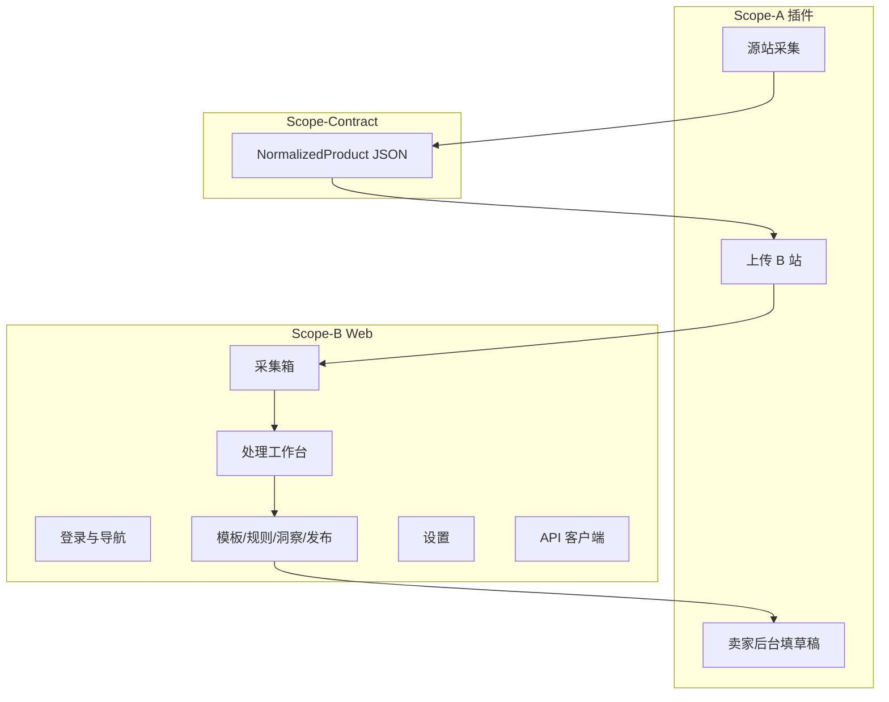

# Scope-A / Scope-B 功能清单（详细）

> **Scope-A** = 浏览器插件 `extension/`  
> **Scope-B** = B 站 Web `web/`（含未来 API 对接面）  
> 数据契约：**Scope-Contract** → `docs/COLLECT_SCHEMA.md` v1.0.0  

状态图例：**✅ 原型已有** · **🔧 进行中/待实测** · **📋 规划（Phase 1/2/3）**

---

## 总览：谁做什么



| 用户步骤 | 主责 |
|----------|------|
| 1. 在 1688/淘宝打开商品页并采集 | Scope-A |
| 2. 在采集箱查看、筛选、批量 | Scope-B |
| 3. 规则 + 模板 + LLM 处理 | Scope-B |
| 4. 创建发布任务 | Scope-B |
| 5. 在 Shopee/淘宝卖家后台填入草稿 | Scope-A |
| 6. 在平台内点击「发布」 | 用户手动 |

---

# Scope-A · 浏览器插件

**目录**：`extension/`  
**技术**：Manifest V3 · Service Worker · Content Scripts · Popup  
**不负责**：React 页面、业务数据库、规则/LLM 管线（属 Scope-B）

---

## A0. 基础架构

| 功能 | 说明 | 状态 | 主要文件 |
|------|------|------|----------|
| MV3 清单 | 权限、host、content 注入规则 | ✅ | `manifest.json` |
| 三端结构 | Popup / Background / Content | ✅ | `popup/`, `background/`, `content/` |
| 站点权限 | 1688、淘宝、天猫、拼多多（移动） | ✅ | `host_permissions` |
| 演示打包 | ZIP 供设置页下载 | ✅ | `web` 侧 `npm run zip:extension` |
| 安装文档 | Chrome 加载 unpacked / ZIP | ✅ | `INSTALL.md` |

---

## A1. 源站商品采集（核心）

### A1.1 分层提取引擎

| 功能 | 说明 | 状态 | 文件 |
|------|------|------|------|
| 统一入口 | `PsaExtractProduct.extractProduct()` | ✅ | `content/shared/extract-product.js` |
| **L1** 内嵌 JSON | `__INIT_DATA__`、`__INITIAL_STATE__` 等 | ✅ | 各 adapter |
| **L2** JSON-LD | Schema.org Product | ✅ | `extract-utils.js` |
| **L4** DOM 兜底 | 多选择器 + 主图列表 | ✅ | 各 adapter |
| 输出契约 | `NormalizedProduct` v1.0.0 | ✅ | `normalize.js` |
| 提取元数据 | `extractLayer`、`extractMethod` | ✅ | 写入每条 payload |
| 服务端选择器热更新 | `GET /extension/selectors` | 📋 P1 | 当前选择器写死在 adapter |

### A1.2 站点适配器

| 站点 | 匹配 URL | 功能点 | 状态 | 文件 |
|------|----------|--------|------|------|
| **1688** | `detail.1688.com` | 标题、价格、主图、SKU、offerId | 🔧 待真实页实测 | `adapters/1688.js` |
| **淘宝** | `item.taobao.com` | 同上 + itemId | 🔧 待实测 | `adapters/taobao.js` |
| **天猫** | `detail.tmall.com` 等 | 与淘宝共用 adapter，source=天猫 | 🔧 待实测 | `adapters/taobao.js` |
| **拼多多** | `mobile.yangkeduo.com` | 仅通用 DOM 兜底 | 📋 P2 | 无专用 adapter |
| **链接模式** | 任意 URL | Popup 手填 → 不经过 L1 | ✅ 演示 | `popup.js` |

### A1.3 采集字段（契约层，Scope-A 必须填满）

| 字段 | 说明 | Scope-A 责任 |
|------|------|----------------|
| `source` | 1688 / 淘宝 / 天猫 | ✅ |
| `sourceUrl` | 当前页 URL | ✅ |
| `title` | 商品标题 | ✅ |
| `price.amount` / `currency` | 标价 | 🔧 部分页需补 |
| `images[]` | 主图 URL 列表 | 🔧 |
| `skus[]` | id、name、price | 🔧 |
| `attributes` | offerId、itemId 等 | 🔧 |
| `capturedAt` | ISO 时间 | ✅ |

---

## A2. Popup 交互

| 功能 | 说明 | 状态 | 文件 |
|------|------|------|------|
| 后台地址配置 | 本地存储 GitHub Pages / localhost | ✅ | `popup.js` |
| **采集当前页** | 向 Content 发 `CAPTURE_PAGE` | ✅ | |
| 采集预览 | 标题、价、**L1/L2/L4**、图片数 | ✅ | |
| **粘贴链接采集** | 手动构造最小 payload | ✅ | 演示用 |
| **上传到采集箱** | 打开 B 站 `?demoImport=` | ✅ | 原型；正式走 A3 API |
| 打开采集箱链接 | 跳转 `/app/inbox` | ✅ | |
| 发布草稿入口 | 选平台 + 提示（演示） | ✅ | Phase 2 接 A4 |
| 登录状态展示 | Extension Token 有效否 | 📋 P1 | 依赖 A3 |

---

## A3. 与 B 站通信（上传）

| 功能 | 说明 | 状态 | 文件 |
|------|------|------|------|
| 演示导入 | URL 编码 JSON → Scope-B 解析 | ✅ | Popup |
| Extension Token | `POST /extension/token` 换短期 Token | 📋 P1 | `background/service-worker.js` |
| 正式上传 | `POST /collect-jobs` + Bearer | 📋 P1 | 与 Scope-B B5/B6 联调 |
| 上传队列 | 失败重试、离线暂存 | 📋 P2 | Background |
| 错误码上报 | selector_miss / captcha 等 | 📋 P1 | `EXTENSION_SPEC.md` |

**请求体（与 Scope-B 一致）**：

```json
{
  "schemaVersion": "1.0.0",
  "channel": "extension",
  "payload": { /* NormalizedProduct */ }
}
```

---

## A4. 卖家后台「发布填表」（Phase 2）

| 功能 | 说明 | 状态 |
|------|------|------|
| 读取发布任务 | Background 拉 `GET /publish-tasks?status=pending` | 📋 P2 |
| Shopee 卖家中心填表 | Content 按选择器填标题/价/图 | 📋 P2 |
| TikTok Shop 填表 | 同上 | 📋 P3 |
| 淘宝卖家后台填表 | 同上 | 📋 P2 |
| 用户确认保存 | 检测「已保存」→ `PATCH` 任务 completed | 📋 P2 |
| 失败回传 | auth_expired / validation_error | 📋 P2 |

**说明**：自动点平台「发布」按钮 **不做**（合规与风控）；仅填草稿。

---

## A5. 批量采集（Phase 2，非插件主路径）

| 功能 | 说明 | 状态 |
|------|------|------|
| 榜单 TOP N 静默爬 | **不在插件做** | — |
| Collect Worker | Playwright + 延迟 250–2400ms | 📋 P2 · `COLLECT_ARCHITECTURE.md` |
| 插件角色 | 仅单页「人在回路」采集 | ✅ 已定 |

---

## A6. 合规与安全

| 功能 | 说明 | 状态 |
|------|------|------|
| 最小权限 | `activeTab` + 分站点 host | ✅ |
| 用户确认上传 | 预览后点击上传 | ✅ |
| Cookie 可选模式 | 显式开关 + 说明 | 📋 P1 |
| 不申请 `<all_urls>` | 审核友好 | ✅ |
| 隐私说明 | 用途、数据去向 | 📋 P1 |

---

## Scope-A 里程碑

| 阶段 | 交付 |
|------|------|
| **当前原型** | 1688/淘宝 L1–L4、Popup、demoImport |
| **Phase 1** | A2/A3 实测通过 + Token + `collect-jobs` |
| **Phase 2** | 1 个平台草稿填表 |
| **Phase 3** | 多平台填表、选择器热更新 |

---

# Scope-B · B 站 Web

**目录**：`web/`  
**技术**：React 19 · Vite · Tailwind v4 · React Router · localStorage 演示 / 未来 React Query + API  
**不负责**：Chrome 插件逻辑、源站 DOM 选择器（属 Scope-A）

---

## B0. 基础架构

| 功能 | 说明 | 状态 | 主要文件 |
|------|------|------|----------|
| 路由与布局 | 登录、侧栏、`/app/*` | ✅ | `App.tsx`, `AppLayout.tsx` |
| 主题系统 | 多套预设 + 自定义 CSS | ✅ | `lib/theme.ts`, `ThemeSettings.tsx` |
| GitHub Pages | base path、404 fallback | ✅ | CI、`lib/router.ts` |
| 品牌 | 电商助手 | ✅ | `lib/brand.ts` |
| Mock 数据 | 演示商品/模板/规则 | ✅ | `lib/mock.ts` |

---

## B1. 认证与首页

| 功能 | 说明 | 状态 | 路由/文件 |
|------|------|------|-----------|
| 登录页 | 演示账号 admin01 | ✅ | `/login` |
| 会话 | localStorage 演示 | ✅ | `lib/auth.ts` |
| 工作台首页 | 统计、快捷入口 | ✅ | `/app` `DashboardPage.tsx` |
| 标准作业流程 | 5 步引导 | ✅ | `WorkflowGuide.tsx` |
| 正式 JWT | `POST /auth/login` | 📋 P1 | API |

---

## B2. 采集箱（与 Scope-A 对接）

| 功能 | 说明 | 状态 | 文件 |
|------|------|------|------|
| 商品列表 | 来源、类目、进价、状态 | ✅ | `InboxPage.tsx` |
| **插件导入** | 解析 `demoImport` URL 参数 | ✅ | `inboxStore.ts` |
| 契约校验 | `isNormalizedProduct()` | ✅ | `collectTypes.ts` |
| 完整快照 | `rawCapture` 存 NormalizedProduct | ✅ | `inboxStore.ts` |
| 展示采集层 | 列表显示 L1/L2/L4 | ✅ | |
| 导入提示 | 成功/失败消息 | ✅ | |
| 插件条目计数 | 演示统计 | ✅ | |
| **API 列表** | `GET /products` | 📋 P1 | React Query |
| **API 导入** | 收 `collect-jobs` 结果 | 📋 P1 | 依赖 A6 |
| 筛选/分页 | status、source | 📋 P1 | |
| 批量删除/标星 | 批量操作 | 📋 P2 | |
| 去重 | 同 URL 合并 | 📋 P2 | |
| 导出 JSON/CSV | Phase 1 交付 | 📋 P1 | |

**内部展示字段**（非上传契约）：`priceCny`、`thumb`、`category`、`status` ← 由契约转换。

---

## B3. 处理工作台

| 功能 | 说明 | 状态 | 路由 |
|------|------|------|------|
| 左右对照 | 原始 vs 处理管线 | ✅ 线框 | `/app/workbench/:id` |
| 源链接 | 跳转 A/C 站 | ✅ | |
| 主图展示 | 来自 `images[]` | ✅ | |
| 采集层信息 | extractLayer / method | ✅ | |
| **规则步骤展示** | 价公式、字数截断 | ✅ 静态 | |
| **临时 Prompt** | 本商品追加 | ✅ 输入框 | |
| **运行管线** | 触发 rules + LLM | 📋 P1 | `POST pipeline-runs` |
| 管线历史 / diff | 可回放 | 📋 P1 | |
| 双输出预览 | 高曝光 / 高转化 | 📋 P3 | |
| 人工改字段 | PATCH product | 📋 P1 | |

---

## B4. 类目模板

| 功能 | 说明 | 状态 | 路由 |
|------|------|------|------|
| 模板列表 | 童装等 | ✅ Mock | `/app/templates` |
| CRUD | Prompt、绑定规则集 | 📋 P1 | API |
| 累积式扩展 | 男装/女装 | 📋 P2 | 产品策略 |
| 与 LLM 网关 | 模板 ID → Prompt 版本 | 📋 P2 | |

---

## B5. 规则库

| 功能 | 说明 | 状态 | 路由 |
|------|------|------|------|
| 规则列表 | 价格/标题/安全/翻译分组 | ✅ Mock | `/app/rules` |
| 公式配置 | 如 VN = CNY × 3500 × 2.5 | 📋 P1 | |
| 标题截断 | ≤20 字按平台 | 📋 P1 | |
| 违禁词 | 过滤列表 | 📋 P2 | |
| 执行顺序 | 规则先于 LLM | 📋 P1 | 架构已定 |

---

## B6. 选品洞察

| 功能 | 说明 | 状态 | 路由 |
|------|------|------|------|
| 关键词列表 | 演示数据 | ✅ Mock | `/app/insights` |
| 竞品 TOP10 | 异步 Job | 📋 P2 | Worker |
| 流量词替换 | 后台数据 + RPA | 📋 P3 | |
| 毛利/价差 | 依赖规则引擎 | 📋 P3 | |

---

## B7. 发布中心

| 功能 | 说明 | 状态 | 路由 |
|------|------|------|------|
| 任务列表 | 平台、商品、状态 | ✅ Mock | `/app/publish` |
| 创建发布任务 | 选商品 + 目标平台 | 📋 P1 | |
| 状态回写 | 插件 PATCH completed | 📋 P2 | 与 A4 联调 |
| 失败原因展示 | selector_miss 等 | 📋 P2 | |

---

## B8. 设置

| 功能 | 说明 | 状态 | 文件 |
|------|------|------|------|
| **插件下载** | ZIP + 安装说明 | ✅ | `ExtensionDownloadCard.tsx` |
| **界面主题** | 预设 + 自定义 CSS | ✅ | `ThemeSettings.tsx` |
| **大模型设置** | 多厂商 API、模型列表、开关 | ✅ | `LlmSettings.tsx` |
| 连接检测 | 模拟检测 API Key | ✅ | |
| 工作流模型绑定 | 翻译/识图等预留下拉 | ✅ | localStorage |
| 插件绑定 / Token | 授权页 | 📋 P1 | 与 A3 |
| 语言/区域 | 目标市场 | 📋 P2 | |

---

## B9. API 与数据层（未来，Scope-B 主对接）

| 模块 | 端点（示例） | Scope-B 职责 | 阶段 |
|------|--------------|--------------|------|
| 采集 | `POST/GET /collect-jobs` | 客户端、采集箱刷新 | P1 |
| 商品 | `GET/PATCH/DELETE /products` | 采集箱、工作台 | P1 |
| 模板 | `/category-templates` | 模板页 | P1 |
| 规则 | `/rule-sets` | 规则页 | P1 |
| 管线 | `/products/:id/pipeline-runs` | 工作台 | P1 |
| 洞察 | `/insights/*` | 洞察页 | P2 |
| 发布 | `/publish-tasks` | 发布中心 | P2 |
| 插件配置 | `/extension/token`, `/extension/selectors` | 设置页展示；A 调用 | P1 |

详见 `docs/API_OUTLINE.md`。实现可在 `api/` 或 mock server，**类型与契约与 Scope-A 对齐**。

---

## B10. 部署与质量

| 功能 | 说明 | 状态 |
|------|------|------|
| `npm run lint` | TypeScript | ✅ |
| `npm run build` | Vite + SPA 404 | ✅ |
| GitHub Actions | deploy-pages | ✅ |
| E2E 测试 | 关键路径 | 📋 P2 |

---

## Scope-B 里程碑

| 阶段 | 交付 |
|------|------|
| **当前原型** | 全页面线框 + 插件导入 + LLM 设置 + 主题 |
| **Phase 1** | 采集箱/工作台接 API；模板+规则+标题 LLM；导出 |
| **Phase 2** | 发布任务；洞察 TOP10；越/泰语 |
| **Phase 3** | 双指标、Admin、团队权限 |

---

# Scope-Contract · 跨边界（非独立子项目）

| 项目 | 路径 | 变更规则 |
|------|------|----------|
| 字段定义 | `docs/COLLECT_SCHEMA.md` | 双人 Review |
| JSON Schema | `shared/schemas/normalized-product.schema.json` | 与上一致 |
| 插件输出 | `extension/.../normalize.js` | Scope-A 改 |
| Web 类型 | `web/src/lib/collectTypes.ts` | Scope-B 改 |

---

# 相关文档索引

| 文档 | 内容 |
|------|------|
| `docs/SCOPE_FEATURES.md` | 本文 |
| `docs/TASK_ASSIGNMENT.md` | 任务 ID 与联调节点 |
| `docs/AGENT_SCOPE.md` | 智能体如何指代 Scope-A/B |
| `docs/DEV_SPLIT.md` | 分支、PR、异步协作 |
| `docs/COLLECT_ARCHITECTURE.md` | Worker 批量采集 |
| `docs/PROJECT_PLAN.md` | 产品总体规划 |
