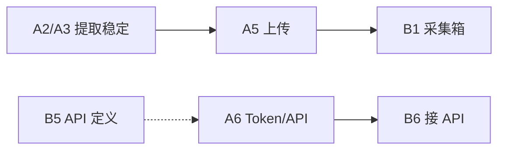

# 任务分工 Scope-A / Scope-B（当前迭代）

> **详细功能列表**：`docs/SCOPE_FEATURES.md`  
> 数据契约：`docs/COLLECT_SCHEMA.md` v1.0.0 · 协作：`docs/DEV_SPLIT.md`

---

## Scope-A · 插件 `extension/`

**目标**：1688 / 淘宝 / 天猫采集、分层提取、上传到 B 站。

| ID | 任务 | 状态 | 路径/备注 |
|----|------|------|-----------|
| A1 | 分层提取 L1→L2→L4 | ✅ 原型 | `content/shared/extract-product.js` |
| A2 | 1688 适配器字段补全 | 待测 | `adapters/1688.js` |
| A3 | 淘宝/天猫适配器字段补全 | 待测 | `adapters/taobao.js` |
| A4 | Popup 预览（层/图数） | ✅ | `popup/popup.js` |
| A5 | 上传采集箱（demoImport） | ✅ | 打开 B 站 URL |
| A6 | Extension Token + `POST collect-jobs` | 待做 | `background/service-worker.js` |
| A7 | 发布草稿填表（1 平台） | 待做 | Phase 2 |
| A8 | 演示 ZIP 与安装说明 | ✅ | `npm run zip:extension` |

**不负责**：`web/` 页面与样式（除非契约 PR）。

**分支前缀**：`feat/ext-*` / `fix/ext-*`

**完成标准**：在 1688、淘宝各导出 1 条 JSON，通过 Schema；B 能在采集箱看到同标题/价/图。

---

## Scope-B · Web `web/`

**目标**：采集箱、工作台、设置、未来 API。

| ID | 任务 | 状态 | 路径/备注 |
|----|------|------|-----------|
| B1 | 采集箱插件导入 + 列表 | ✅ 原型 | `inboxStore.ts`, `InboxPage.tsx` |
| B2 | 工作台 raw 快照/主图 | ✅ 原型 | `WorkbenchPage.tsx` |
| B3 | 大模型设置 | ✅ | `LlmSettings.tsx` |
| B4 | 主题 / 插件下载 / 流程 | ✅ | `SettingsPage.tsx` |
| B5 | `collect-jobs` API（mock→真） | 待做 | 对齐 `API_OUTLINE.md` |
| B6 | 采集箱接 API 替代 demoImport | 待做 | 依赖 A6 |
| B7 | 批量采集任务 UI | 待做 | Phase 2，依赖 Worker |
| B8 | GitHub Pages 部署验收 | 持续 | CI `deploy-pages` |

**不负责**：`extension/` 选择器与提取逻辑（除非契约 PR）。

**分支前缀**：`feat/web-*` / `fix/web-*`

**完成标准**：收到 A 的样例 JSON 可导入；`npm run lint` + `build` 通过。

---

## 联调节点（两人只需对齐这 3 次）

| 节点 | A 交付 | B 验收 |
|------|--------|--------|
| **L0** | 1 条 1688 样例 JSON | 采集箱导入成功，显示 L1/L2/L4 |
| **L1** | 1 条淘宝样例 JSON | 同上 + 工作台主图 |
| **L2** | `POST collect-jobs` 可调通 | 采集箱走 API，不再只靠 URL 参数 |

样例 JSON 贴在 PR 或 Issue 评论里，不要只发截图。

---

## 依赖关系



契约变更（任意字段）：**暂停 A2–B6**，先合并 schema PR。

---

## Issue 标题模板（GitHub）

```text
[ext] A2: 1688 价格与 SKU 提取补全
[ext] A6: Background 对接 collect-jobs
[web] B5: collect-jobs mock API
[web] B6: 采集箱改 API 导入
[schema] bump 1.1.0: 新增 xxx 字段
```
