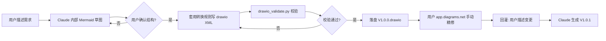

# Yitang Diagram Pack

> **Mermaid 思考 + drawio 交付** — 项目用图生成器

[](.claude-plugin/plugin.json)
[](LICENSE)
[](https://docs.claude.com)

为项目交付场景量身定制的图生成工具集。**Mermaid 作为内部思考与讨论格式，drawio 作为最终交付物**，兼顾效率与精修。

## ✨ 特性

- 🎯 **三轨制图**：Mermaid（过程）/ PlantUML（UML 标准）/ **drawio（交付）**
- 📐 **9 类图模板**：数据流图、架构图（C4）、时序图、ER 图、状态机、流程图、部署图、类图、用户旅程
- 🔄 **Mermaid → drawio 转换规则**：完整映射表
- 🛠️ **辅助脚本**：drawio XML 校验、Mermaid→SVG、统一样式常量
- ⚡ **6 个斜杠命令**：`/draw-dataflow` `/draw-architecture` `/draw-sequence` `/draw-er` `/draw-state` `/draw-flow`
- 🔁 **回灌迭代**：用户在 app.diagrams.net 手动改完后，可让 Claude 解析并生成新版本
- 🛡️ **设计保留铁律**：不删减历史节点/边，与项目 `.claude/design-preservation.md` 一致

## 📦 安装

### 方式 1：本地直接使用（开发态）

把本目录作为本地 marketplace 添加到你的 Claude Code：

```bash
# 在 Claude Code 中执行
/plugin marketplace add ./plugins/yitang-diagram-pack
```

### 方式 2：从 GitHub 安装（发布后）

```bash
/plugin marketplace add tuerqidelvfanzi/yitang-diagram-pack
```

### 方式 3：手动复制

```bash
# 复制整个 plugins/yitang-diagram-pack 到你的项目
cp -r yitang-diagram-pack /path/to/your/project/.claude/plugins/
# 然后重启 Claude Code 即可发现
```

## 🚀 快速开始

### 用斜杠命令

```bash
/draw-dataflow    # 数据流图
/draw-architecture  # 系统架构图
/draw-sequence   # 时序图
/draw-er         # ER 图
/draw-state      # 状态机
/draw-flow       # 业务流程图
```

### 自然语言触发

> "画一个登录流程的数据流图"
> 
> "给我们的电商系统画一个 C4 Container 图"
> 
> "把'订单状态机'升级到 V1.0.6"

Claude 会自动激活 `diagram-generator` skill，按以下流程工作：

```
1. 理解需求 → 2. Mermaid 草图 → 3. 询问确认 → 4. 转 drawio → 5. 校验 → 6. 落盘
```

## 📁 目录结构

```
yitang-diagram-pack/
├── .claude-plugin/
│   ├── plugin.json            ← 插件清单
│   └── marketplace.json       ← 市场注册
├── skills/
│   ├── image-understanding/   ← 复用：图片理解（MiniMax VLM）
│   │   └── SKILL.md
│   └── diagram-generator/     ← 核心：图生成器
│       ├── SKILL.md
│       ├── references.md      ← Mermaid 速查 + drawio 节点 + 转换规则
│       ├── templates.md       ← 9 类图模板
│       ├── examples.md        ← 端到端示例
│       └── scripts/
│           ├── styles.py           ← 统一样式常量
│           ├── drawio_validate.py  ← XML 校验
│           └── mermaid_to_svg.py   ← Mermaid→SVG（预览）
├── commands/                  ← 6 个斜杠命令
│   ├── draw-dataflow.md
│   ├── draw-architecture.md
│   ├── draw-sequence.md
│   ├── draw-er.md
│   ├── draw-state.md
│   └── draw-flow.md
├── README.md
├── LICENSE
├── CHANGELOG.md
└── .gitignore
```

## 🎨 工作流：Mermaid 思考 + drawio 交付

### 为什么是这个组合？

| 工具 | 优势 | 劣势 |
|------|------|------|
| **Mermaid** | 写快、git diff 友好、Markdown 原生 | 视觉不够精美 |
| **drawio** | 视觉精美、可手动编辑、客户认可 | XML 难 diff |

**最佳实践**：用 Mermaid **快速迭代**（对话内几分钟完成），用 drawio **精修交付**（app.diagrams.net 拖拽调优）。

### 完整流程



## 🛠️ 辅助脚本

### drawio 校验

```bash
python skills/diagram-generator/scripts/drawio_validate.py path/to/file.drawio
# 或校验整个目录
python skills/diagram-generator/scripts/drawio_validate.py docs/architecture-diagrams/
```

输出示例：
```
=== 架构图深层重新分析V1.0.9.drawio ===
  ✅ 骨架: 0 个问题
  ✅ 引用: 0 个问题
  ⚠️  空值: 0 个问题
  ⚠️  孤岛: 0 个问题
汇总: 1/1 文件通过硬校验
```

### Mermaid → SVG（README 预览）

```bash
# 需先 npm i -g @mermaid-js/mermaid-cli
python skills/diagram-generator/scripts/mermaid_to_svg.py README.md out/preview
```

### 复用样式常量

```python
from skills.diagram_generator.scripts.styles import STYLE_DATA, EDGE_DASHED

# 在你自己生成 drawio 的脚本里
style = STYLE_DATA  # 圆柱（数据库）
edge_style = EDGE_DASHED  # 虚线边
```

## 📋 9 类图模板

| 模板 | 用途 | 典型场景 |
|------|------|----------|
| T1 数据流图 | DFD 0/1/2 层 | 系统交互、模块依赖 |
| T2 架构图/C4 | Container/Component | 系统组成、技术栈 |
| T3 时序图 | Sequence | 接口调用、协议流程 |
| T4 ER 图 | 实体关系 | 数据库设计、领域模型 |
| T5 状态机 | State Machine | 订单状态、工作流 |
| T6 业务流程 | Flowchart | 业务操作、审批流 |
| T7 部署图 | Deployment | 物理/云架构 |
| T8 类图 | Class Diagram | OOP 设计 |
| T9 用户旅程 | Journey | UX 设计 |

详见 [skills/diagram-generator/templates.md](skills/diagram-generator/templates.md)。

## 🛡️ 设计保留铁律

> 来自项目 `.claude/design-preservation.md`

- ✅ 历史版本节点、边、样式必须完整保留
- ⚠️ 任何"简化"必须先读设计文档，对比后警告
- ✅ 新增内容**追加**而非替换
- ❌ 不得覆盖历史版本文件（V1.0.0 → V1.0.1 → V1.0.2 ...）

## 🧪 兼容性

- ✅ Claude Code（VSCode 扩展 + CLI）
- ✅ Cursor（通过 `.cursor-plugin` 适配）
- ✅ app.diagrams.net（手动精修）
- ✅ 任何 drawio 兼容工具（draw.io Desktop、Confluence 插件等）

## 📝 License

MIT — 见 [LICENSE](LICENSE)

## 🤝 贡献

欢迎 PR！但请遵守：
1. 模板新增时，必须**同时提供 Mermaid + drawio** 两个版本
2. 样式常量请统一在 `scripts/styles.py` 中维护
3. 不要修改 `references.md` 已有的转换规则表，只能追加

## 📮 联系

- GitHub: [@tuerqidelvfanzi](https://github.com/tuerqidelvfanzi)
- Issues: [提交](https://github.com/tuerqidelvfanzi/yitang-diagram-pack/issues)
