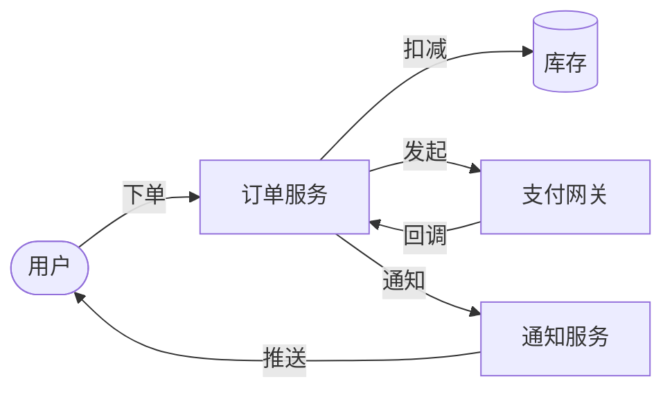

# 端到端示例

## 例 1：电商下单 DFD（最常见）

### 用户请求
> "画一下电商下单的数据流图，包括用户、订单服务、库存、支付和通知。"

### Step 1 - 内部 Mermaid 草图


### Step 2 - 询问用户
> "结构 OK 吗？确认后我转 drawio，落盘到 docs/architecture-diagrams/下单流程V1.0.0.drawio。"

### Step 3 - 转 drawio（节选）
```xml
<mxCell id="user" value="用户"
        style="shape=mxgraph.flowchart.terminator;whiteSpace=wrap;html=1;fillColor=#f8cecc;strokeColor=#b85450;fontSize=12;"
        vertex="1" parent="1">
  <mxGeometry x="40" y="200" width="80" height="40" as="geometry"/>
</mxCell>
<!-- ... 其他节点 ... -->
```

### Step 4 - 校验
```bash
python plugins/yitang-diagram-pack/skills/diagram-generator/scripts/drawio_validate.py \
       docs/architecture-diagrams/下单流程V1.0.0.drawio
# ✅ 骨架: 0 个问题
# ✅ 引用: 0 个问题
# ⚠️  空值: 0 个问题
# ⚠️  孤岛: 0 个问题
```

### Step 5 - 落盘 + CHANGELOG
```markdown
<!-- docs/architecture-diagrams/CHANGELOG-下单流程.md -->
## V1.0.0 (2026-06-04)
- ✅ 新增：用户、订单服务、库存、支付、通知 5 节点
- ✅ 6 条边（用户→订单、订单→库存、订单→支付、支付→订单回调、订单→通知、通知→用户）
- 📋 状态：已确认
```

---

## 例 2：升级现有架构图 V1.0.x → V1.0.x+1

### 用户请求
> "V1.0.5 的'架构图深层重新分析'太挤了，把第 4 列拉宽点，节点间距加 30。"

### Step 1 - 读历史版本
读取 `docs/architecture-diagrams/架构图深层重新分析V1.0.5.drawio`，分析现有布局。

### Step 2 - 描述变更（用 Mermaid 与用户确认）
> "准备这样改：
> - 第 4 列宽度从 280 改 310
> - 节点行间距从 30 改 60
> - 其他不动
> 可以吗？"

### Step 3 - 复制 + 修改 + 新版本号
读取 V1.0.5 → 修改坐标属性 → 写为 V1.0.6。

### Step 4 - 校验新旧并存
```bash
python .../drawio_validate.py docs/architecture-diagrams/架构图深层重新分析V1.0.6.drawio
```

### Step 5 - CHANGELOG
```markdown
## V1.0.6 (2026-06-04)
- 📐 布局：第4列宽度 280→310；行间距 30→60
- ✅ 节点/边数量与 V1.0.5 完全一致（无删减）
- 📋 状态：待评审
```

---

## 例 3：手动编辑后回灌（drawio → Claude → drawio）

### 用户操作
1. 用 app.diagrams.net 打开 `下单流程V1.0.0.drawio`
2. 手动调整某个节点位置、修改某条边标签
3. 保存为 `下单流程V1.0.1.drawio`

### 用户对 Claude 说
> "V1.0.1 我手动改了：把'通知服务'挪到了右上角，边标签从'推送'改成'短信+邮件'。看下 OK 吗，再生成 V1.0.2 落盘。"

### Claude 流程
1. 读 V1.0.1 解析改动
2. 输出 Mermaid 反映新结构（确认理解）
3. 询问："理解对吗？"
4. 确认后生成 V1.0.2
