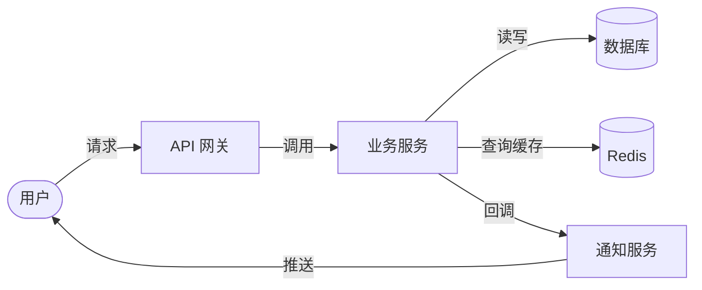
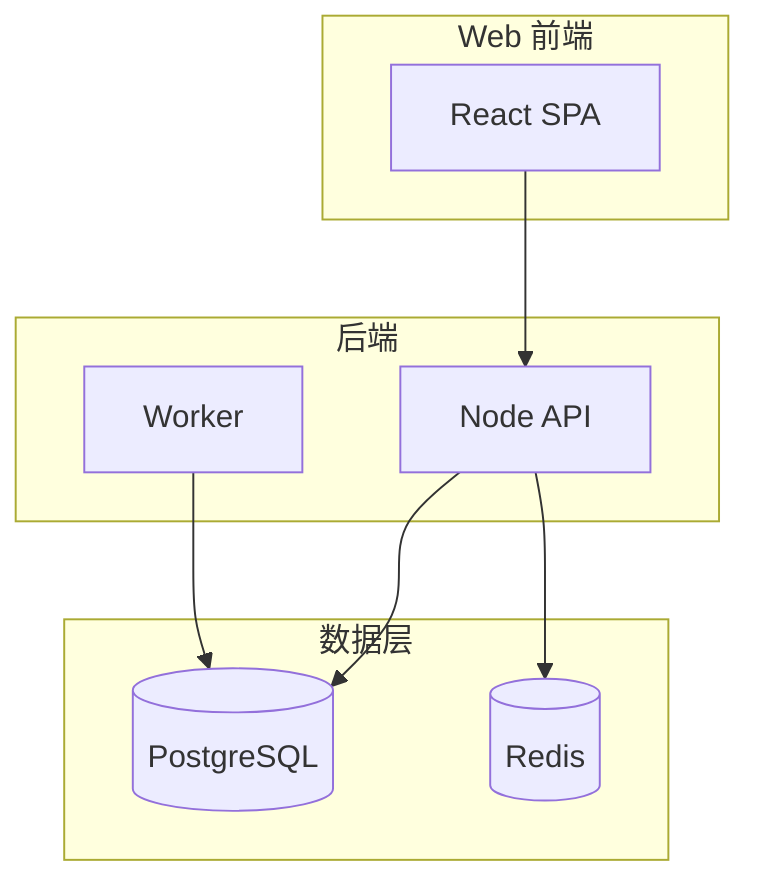
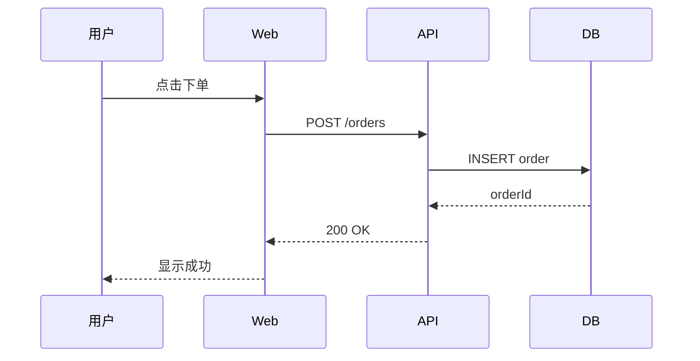
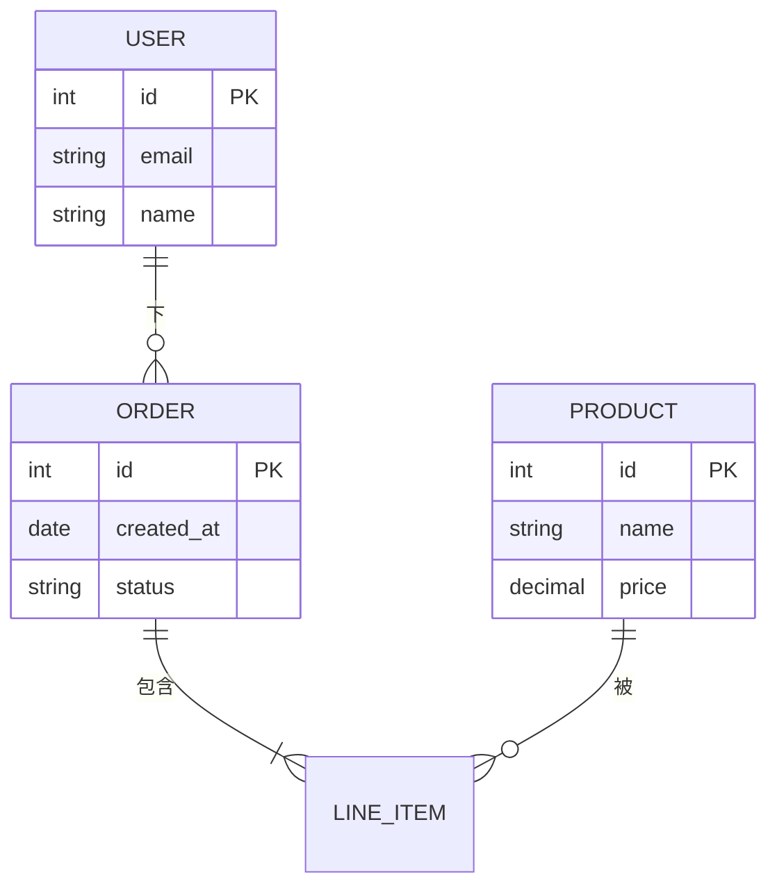
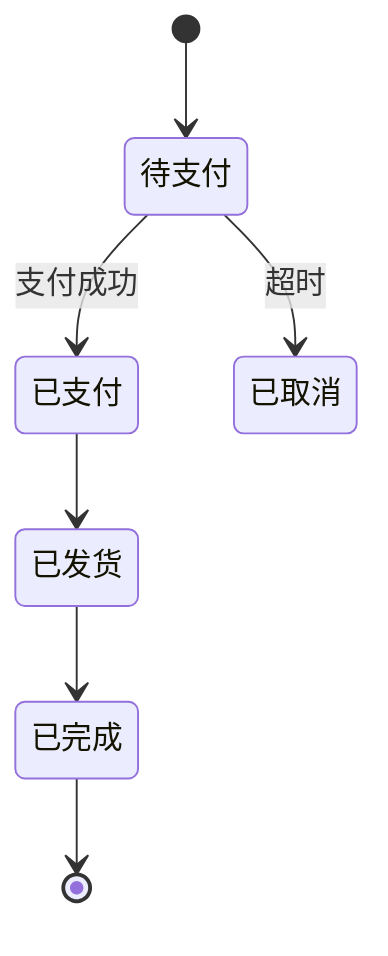
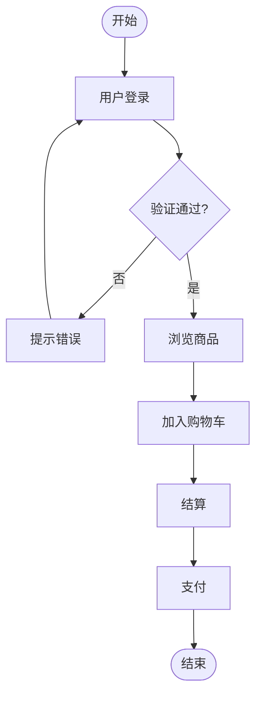
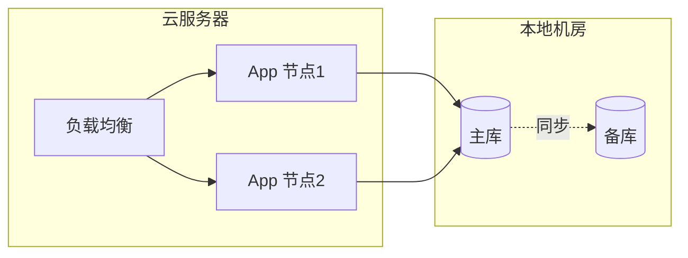
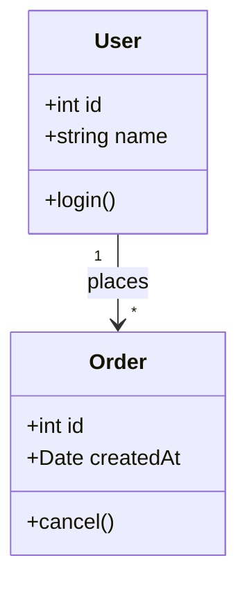
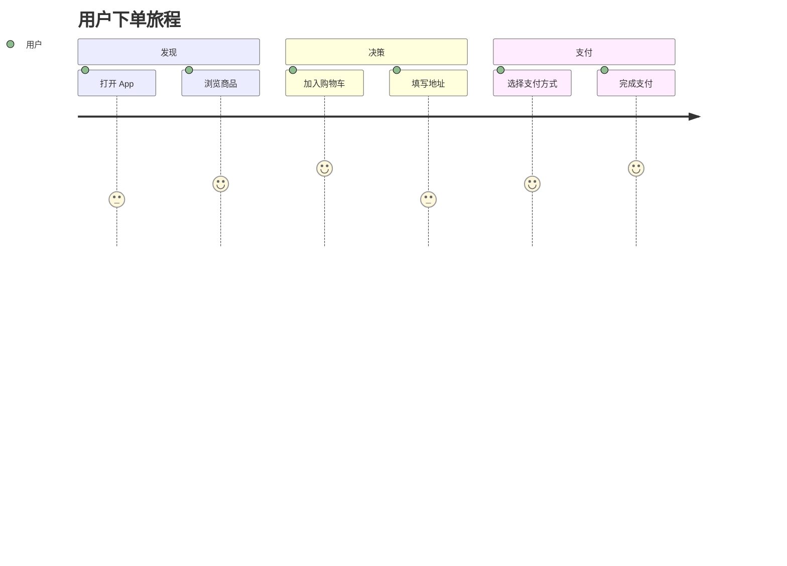

# 模板库（9 类图）

> 每类图提供：**Mermaid 思考模板** + **drawio 交付模板**。
> 顺序：先和用户用 Mermaid 对齐 → 确认后套 drawio 模板手算坐标。

---

## T1. 数据流图 / DFD

### Mermaid（草图）


### drawio XML（交付）
```xml
<?xml version="1.0" encoding="UTF-8"?>
<mxfile host="app.diagrams.net" modified="2026-06-04T00:00:00.000Z" agent="claude-code" version="24.0.0">
  <diagram name="DFD" id="dfd1">
    <mxGraphModel dx="1422" dy="794" grid="1" gridSize="10" pageWidth="850" pageHeight="600" math="0" shadow="0">
      <root>
        <mxCell id="0"/>
        <mxCell id="1" parent="0"/>

        <!-- 用户 -->
        <mxCell id="user" value="用户" style="shape=mxgraph.flowchart.terminator;whiteSpace=wrap;html=1;fillColor=#f8cecc;strokeColor=#b85450;fontSize=12;"
                vertex="1" parent="1">
          <mxGeometry x="40" y="200" width="80" height="40" as="geometry"/>
        </mxCell>

        <!-- API 网关 -->
        <mxCell id="api" value="API 网关" style="rounded=1;whiteSpace=wrap;html=1;fillColor=#dae8fc;strokeColor=#6c8ebf;fontSize=12;"
                vertex="1" parent="1">
          <mxGeometry x="180" y="200" width="100" height="40" as="geometry"/>
        </mxCell>

        <!-- 业务服务 -->
        <mxCell id="service" value="业务服务" style="rounded=1;whiteSpace=wrap;html=1;fillColor=#dae8fc;strokeColor=#6c8ebf;fontSize=12;"
                vertex="1" parent="1">
          <mxGeometry x="340" y="200" width="100" height="40" as="geometry"/>
        </mxCell>

        <!-- DB -->
        <mxCell id="db" value="数据库" style="shape=cylinder3;whiteSpace=wrap;html=1;boundedLbl=1;backgroundOutline=1;size=15;fillColor=#e1d5e7;strokeColor=#9673a6;"
                vertex="1" parent="1">
          <mxGeometry x="500" y="80" width="80" height="80" as="geometry"/>
        </mxCell>

        <!-- Cache -->
        <mxCell id="cache" value="Redis" style="shape=cylinder3;whiteSpace=wrap;html=1;boundedLbl=1;backgroundOutline=1;size=15;fillColor=#e1d5e7;strokeColor=#9673a6;"
                vertex="1" parent="1">
          <mxGeometry x="500" y="200" width="80" height="80" as="geometry"/>
        </mxCell>

        <!-- 通知服务 -->
        <mxCell id="notify" value="通知服务" style="rounded=1;whiteSpace=wrap;html=1;fillColor=#dae8fc;strokeColor=#6c8ebf;fontSize=12;"
                vertex="1" parent="1">
          <mxGeometry x="500" y="320" width="100" height="40" as="geometry"/>
        </mxCell>

        <!-- 边 -->
        <mxCell id="e1" value="请求" style="endArrow=classic;html=1;labelBackgroundColor=#fff;" edge="1" parent="1" source="user" target="api">
          <mxGeometry relative="1" as="geometry"/>
        </mxCell>
        <mxCell id="e2" style="endArrow=classic;html=1;" edge="1" parent="1" source="api" target="service">
          <mxGeometry relative="1" as="geometry"/>
        </mxCell>
        <mxCell id="e3" value="读写" style="endArrow=classic;html=1;labelBackgroundColor=#fff;" edge="1" parent="1" source="service" target="db">
          <mxGeometry relative="1" as="geometry"/>
        </mxCell>
        <mxCell id="e4" value="查询缓存" style="endArrow=classic;html=1;labelBackgroundColor=#fff;" edge="1" parent="1" source="service" target="cache">
          <mxGeometry relative="1" as="geometry"/>
        </mxCell>
        <mxCell id="e5" value="回调" style="endArrow=classic;html=1;labelBackgroundColor=#fff;" edge="1" parent="1" source="service" target="notify">
          <mxGeometry relative="1" as="geometry"/>
        </mxCell>
        <mxCell id="e6" value="推送" style="endArrow=classic;html=1;labelBackgroundColor=#fff;" edge="1" parent="1" source="notify" target="user">
          <mxGeometry relative="1" as="geometry"/>
        </mxCell>
      </root>
    </mxGraphModel>
  </diagram>
</mxfile>
```

---

## T2. 系统架构图 / C4 Container

### Mermaid


### drawio 关键结构
- 3 个 container：`subgraph_Web`、`subgraph_Server`、`subgraph_Data`
- 每个 container 包含 1-2 个子节点
- 跨 container 边用普通 edge

---

## T3. 时序图

### Mermaid


### drawio 关键结构
- 顶部放角色（`shape=umlActor` 或 `shape=mxgraph.flowchart.terminator`），**全部 y 对齐**
- 消息线为**虚线竖直箭头**（`endArrow=open;dashed=1;vertical=1`）
- 标签写在边的中间

---

## T4. ER 图

### Mermaid


### drawio 关键结构
- 实体用 `STYLE_TITLE`（黄色背景）
- 字段用 `STYLE_DEFAULT`（蓝色），每个字段一个节点
- 关系用菱形 `shape=rhombus`
- 三种关系：`1--1`、`1--N`、`N--M`，通过边的 source/target 数量体现

---

## T5. 状态机图

### Mermaid


### drawio 关键结构
- 状态节点用 `rounded=1;`（圆角矩形）
- 转换用普通 edge + 标签
- 起点：`shape=mxgraph.flowchart.terminator` + 入边 from `[*]`
- 终点：同上 + 出边 to `[*]`

---

## T6. 业务流程图

### Mermaid


### drawio 关键结构
- 开始/结束：`shape=mxgraph.flowchart.terminator`
- 普通步骤：`STYLE_DEFAULT`
- 决策：`shape=rhombus`
- 异常分支：虚线边

---

## T7. 部署图

### Mermaid


### drawio 关键结构
- 物理边界用 container（`subgraph_Cloud`、`subgraph_OnPrem`）
- 同步关系用虚线 + 标签 "同步"
- 节点用 `STYLE_EXTERN`（灰色虚线框）标记外部依赖

---

## T8. 类图

### Mermaid


### drawio 关键结构
- 类用三段式（标题/属性/方法）：通过 value 内的 HTML `<br>` 分行
- 类用 `STYLE_TITLE`
- 关系：实线箭头（关联）、空心三角（继承）、空心菱形（聚合）、实心菱形（组合）

---

## T9. 用户旅程图

### Mermaid


### drawio 关键结构
- 用横向 swimlane（每个 section 一行）
- 体验分数用 1-5 颗星（额外节点 + 边的形式）
- 顶部放用户图标 `shape=umlActor`
